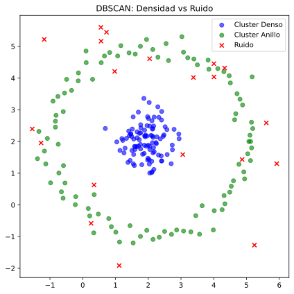

# 🔬 Unidad 3. Algoritmo DBSCAN

**DBSCAN** (Density-Based Spatial Clustering of Applications with Noise) es un algoritmo de clustering basado en **densidad**. A diferencia de K-Means, DBSCAN puede descubrir clusters de **formas arbitrarias** y es capaz de identificar automáticamente **puntos de ruido** (outliers). No requiere especificar el número de clusters a priori, lo cual lo hace extremadamente útil cuando no conocemos la estructura de los datos.


---

## 3.1. ¿Cómo Funciona DBSCAN?

### Intuición del Algoritmo

DBSCAN agrupa puntos que están **densamente empaquetados** juntos, marcando como outliers los puntos que están aislados en regiones de baja densidad. La idea central es:

> "Un cluster es una región de alta densidad separada de otras regiones por áreas de baja densidad."

### Conceptos Fundamentales

DBSCAN define tres tipos de puntos basándose en dos parámetros: **ε (epsilon)** y **MinPts**:

```
┌─────────────────────────────────────────────────────────────┐
│ CONCEPTOS CLAVE DE DBSCAN                                   │
├─────────────────────────────────────────────────────────────┤
│                                                             │
│  ε (epsilon): Radio de vecindad                             │
│  MinPts: Número mínimo de puntos para formar un núcleo      │
│                                                             │
│  TIPOS DE PUNTOS:                                           │
│                                                             │
│  1. PUNTO NÚCLEO (Core Point):                              │
│     Tiene al menos MinPts puntos dentro de su ε-vecindad    │
│     (incluyéndose a sí mismo)                               │
│                                                             │
│  2. PUNTO FRONTERA (Border Point):                          │
│     No es un punto núcleo, pero está dentro de la           │
│     ε-vecindad de un punto núcleo                           │
│                                                             │
│  3. PUNTO DE RUIDO (Noise Point):                           │
│     No es ni punto núcleo ni punto frontera                 │
│     → Se considera OUTLIER                                  │
│                                                             │
└─────────────────────────────────────────────────────────────┘
```

### Visualización de Conceptos

```
        ε-vecindad
           ___
         /     \
        |   ●   |  ← Punto Núcleo (≥ MinPts vecinos)
        | ● ● ● |
         \_●_●_/
           
     ○               ← Punto Frontera (en vecindad de núcleo)
     
                 ×   ← Punto de Ruido (aislado)
```

### Algoritmo Paso a Paso

```
┌─────────────────────────────────────────────────────────────┐
│ ALGORITMO DBSCAN                                            │
├─────────────────────────────────────────────────────────────┤
│ Entrada: Datos X, epsilon ε, MinPts                         │
│ Salida: Asignaciones de cluster (o -1 para ruido)           │
│                                                             │
│ 1. Para cada punto P no visitado:                           │
│    a) Marcar P como visitado                                │
│    b) Encontrar todos los vecinos de P en radio ε           │
│    c) SI |vecinos| < MinPts:                                │
│          Marcar P como RUIDO (temporalmente)                │
│       SINO:                                                 │
│          Crear nuevo cluster C                              │
│          Agregar P a C                                      │
│          Para cada punto Q en vecinos:                      │
│            - Si Q no visitado: visitar y expandir           │
│            - Si Q no asignado: agregar Q a C                │
│                                                             │
│ 2. Los puntos de ruido que están en la ε-vecindad de un    │
│    punto núcleo se reasignan como puntos frontera           │
│                                                             │
│ NOTA: No hay fase de "entrenamiento" tradicional            │
└─────────────────────────────────────────────────────────────┘
```

---

## 3.2. Explicación Matemática

### ε-Vecindad (Epsilon-Neighborhood)

La ε-vecindad de un punto $p$ es el conjunto de todos los puntos que están a una distancia menor o igual a ε:

$$N_\varepsilon(p) = \{q \in D \mid dist(p, q) \leq \varepsilon\}$$

Donde:
- $D$ = conjunto de datos
- $dist(p, q)$ = función de distancia (típicamente Euclidiana)

### Definiciones Formales

**Punto Núcleo (Core Point):**
Un punto $p$ es un punto núcleo si:
$$|N_\varepsilon(p)| \geq MinPts$$

**Directamente Alcanzable por Densidad:**
Un punto $q$ es directamente alcanzable por densidad desde $p$ si:
1. $p$ es un punto núcleo
2. $q \in N_\varepsilon(p)$

**Alcanzable por Densidad:**
Un punto $q$ es alcanzable por densidad desde $p$ si existe una cadena de puntos $p_1, p_2, ..., p_n$ donde:
- $p_1 = p$
- $p_n = q$
- $p_{i+1}$ es directamente alcanzable por densidad desde $p_i$

**Conectado por Densidad:**
Dos puntos $p$ y $q$ están conectados por densidad si existe un punto $o$ tal que tanto $p$ como $q$ son alcanzables por densidad desde $o$.

### Definición de Cluster

Un cluster $C$ en DBSCAN satisface:
1. **Maximalidad:** Si $p \in C$ y $q$ es alcanzable por densidad desde $p$, entonces $q \in C$
2. **Conectividad:** Todos los puntos en $C$ están conectados por densidad

### Métricas de Distancia

DBSCAN puede usar diferentes métricas de distancia:

**Distancia Euclidiana (por defecto):**
$$d(p, q) = \sqrt{\sum_{i=1}^{n} (p_i - q_i)^2}$$

**Distancia Manhattan:**
$$d(p, q) = \sum_{i=1}^{n} |p_i - q_i|$$

**Distancia de Minkowski (generalización):**
$$d(p, q) = \left(\sum_{i=1}^{n} |p_i - q_i|^p\right)^{1/p}$$

---

## 3.3. Pros y Contras

| Ventajas | Desventajas |
| :--- | :--- |
| **No requiere k:** No necesita especificar el número de clusters a priori | **Sensible a parámetros:** ε y MinPts son críticos y difíciles de elegir |
| **Formas arbitrarias:** Puede encontrar clusters de cualquier forma | **Densidad variable:** No maneja bien clusters con densidades muy diferentes |
| **Detección de outliers:** Identifica automáticamente puntos de ruido | **Alta dimensionalidad:** Sufre de la "maldición de la dimensionalidad" |
| **Robusto a outliers:** Los outliers no afectan los centroides (no los hay) | **Computacionalmente costoso:** $O(n^2)$ sin índice espacial |
| **Determinístico:** Mismo resultado (casi) con mismos parámetros | **Puntos frontera ambiguos:** Pueden asignarse arbitrariamente si están entre clusters |

---

## 3.4. Ejemplo Básico en Python

Este ejemplo muestra el uso básico de DBSCAN con datos que tienen formas no esféricas.

```python
# ============================================================
# EJEMPLO BÁSICO: DBSCAN con datos de forma arbitraria
# ============================================================

# Importar bibliotecas necesarias
import numpy as np                          # Operaciones numéricas
import matplotlib.pyplot as plt             # Visualización
from sklearn.cluster import DBSCAN          # Algoritmo DBSCAN
from sklearn.datasets import make_moons     # Datos en forma de luna
from sklearn.preprocessing import StandardScaler  # Escalado

# -------------------------------------------------------------
# 1. GENERAR DATOS DE EJEMPLO (FORMA DE MEDIA LUNA)
# -------------------------------------------------------------
# make_moons genera dos semicírculos entrelazados
# Estos datos NO pueden ser correctamente agrupados por K-Means
X, y_true = make_moons(
    n_samples=300,      # 300 puntos en total (150 por luna)
    noise=0.05,         # Pequeño ruido añadido
    random_state=42     # Reproducibilidad
)

# Añadir algunos outliers manualmente para demostración
outliers = np.array([[-0.5, 0.8], [1.5, -0.3], [2.0, 0.8]])
X = np.vstack([X, outliers])

print(f"Forma de los datos: {X.shape}")
print(f"Muestra de datos:\n{X[:5]}")

# -------------------------------------------------------------
# 2. PREPROCESAMIENTO: ESTANDARIZACIÓN
# -------------------------------------------------------------
# Aunque DBSCAN no requiere estrictamente escalado,
# es buena práctica para que epsilon sea más interpretable
scaler = StandardScaler()
X_scaled = scaler.fit_transform(X)

# -------------------------------------------------------------
# 3. CREAR Y APLICAR DBSCAN
# -------------------------------------------------------------
# Instanciar DBSCAN con parámetros básicos
dbscan = DBSCAN(
    eps=0.3,            # Radio de vecindad (epsilon)
    min_samples=5       # Mínimo de puntos para ser núcleo (MinPts)
)

# fit_predict: aplica DBSCAN y devuelve las etiquetas
# Etiquetas: 0, 1, 2, ... para clusters
#            -1 para puntos de RUIDO (outliers)
labels = dbscan.fit_predict(X_scaled)

print(f"\nEtiquetas únicas: {np.unique(labels)}")
print(f"Número de clusters encontrados: {len(set(labels)) - (1 if -1 in labels else 0)}")
print(f"Número de outliers: {np.sum(labels == -1)}")

# Distribución de puntos por cluster
print("\nDistribución de puntos:")
for label in np.unique(labels):
    count = np.sum(labels == label)
    if label == -1:
        print(f"  Ruido (outliers): {count} puntos")
    else:
        print(f"  Cluster {label}: {count} puntos")

# -------------------------------------------------------------
# 4. OBTENER INFORMACIÓN ADICIONAL
# -------------------------------------------------------------
# core_sample_indices_: índices de los puntos núcleo
core_samples = dbscan.core_sample_indices_
print(f"\nNúmero de puntos núcleo: {len(core_samples)}")

# components_: los puntos núcleo como array
print(f"Forma de components_: {dbscan.components_.shape}")

# -------------------------------------------------------------
# 5. VISUALIZACIÓN DE RESULTADOS
# -------------------------------------------------------------
plt.figure(figsize=(12, 5))

# 5.1 Clusters encontrados por DBSCAN
plt.subplot(1, 2, 1)

# Crear máscara para puntos núcleo
core_mask = np.zeros_like(labels, dtype=bool)
core_mask[core_samples] = True

# Colores: usar colormap para clusters, negro para ruido
unique_labels = set(labels)
colors = plt.cm.viridis(np.linspace(0, 1, len(unique_labels)))

for label, color in zip(unique_labels, colors):
    if label == -1:
        # Puntos de ruido en negro
        color = 'black'
        marker = 'x'
        size = 50
        label_name = 'Ruido'
    else:
        marker = 'o'
        size = 50
        label_name = f'Cluster {label}'
    
    mask = labels == label
    plt.scatter(X_scaled[mask, 0], X_scaled[mask, 1],
                c=[color], marker=marker, s=size,
                label=label_name, alpha=0.7, edgecolors='w')

# Resaltar puntos núcleo con borde
plt.scatter(X_scaled[core_mask, 0], X_scaled[core_mask, 1],
            facecolors='none', edgecolors='red', s=100,
            linewidths=1.5, label='Puntos núcleo')

plt.xlabel('Feature 1 (escalada)')
plt.ylabel('Feature 2 (escalada)')
plt.title(f'DBSCAN (eps={dbscan.eps}, min_samples={dbscan.min_samples})')
plt.legend(loc='upper right')
plt.grid(True, alpha=0.3)

# 5.2 Comparación con las clases reales
plt.subplot(1, 2, 2)
y_true_extended = np.concatenate([y_true, [-1, -1, -1]])  # Outliers
plt.scatter(X_scaled[:, 0], X_scaled[:, 1], c=y_true_extended,
            cmap='viridis', alpha=0.7, edgecolors='w', s=50)
plt.xlabel('Feature 1 (escalada)')
plt.ylabel('Feature 2 (escalada)')
plt.title('Datos originales (Ground Truth)')
plt.grid(True, alpha=0.3)

plt.tight_layout()
plt.show()
```

**Salida esperada:**
```
Forma de los datos: (303, 2)
Etiquetas únicas: [-1  0  1]
Número de clusters encontrados: 2
Número de outliers: 3
Distribución de puntos:
  Ruido (outliers): 3 puntos
  Cluster 0: 150 puntos
  Cluster 1: 150 puntos
```

---

## 3.5. Ejemplo Avanzado: Selección de Parámetros y Análisis Completo

Este ejemplo muestra cómo elegir los parámetros ε y MinPts de forma sistemática.

```python
# ============================================================
# EJEMPLO AVANZADO: DBSCAN con selección de parámetros
# ============================================================

import numpy as np
import pandas as pd
import matplotlib.pyplot as plt
from sklearn.cluster import DBSCAN
from sklearn.preprocessing import StandardScaler
from sklearn.neighbors import NearestNeighbors
from sklearn.metrics import silhouette_score
from sklearn.datasets import make_blobs

# -------------------------------------------------------------
# 1. GENERAR DATOS CON RUIDO
# -------------------------------------------------------------
# Crear clusters con diferentes densidades y añadir ruido
np.random.seed(42)

# Cluster 1: denso
X1 = np.random.randn(200, 2) * 0.5 + [0, 0]

# Cluster 2: más disperso
X2 = np.random.randn(150, 2) * 0.8 + [5, 5]

# Cluster 3: alargado
X3 = np.random.randn(100, 2) * np.array([0.3, 1.5]) + [2, -3]

# Ruido uniforme
noise = np.random.uniform(-3, 8, size=(30, 2))

# Combinar todos los datos
X = np.vstack([X1, X2, X3, noise])
y_true = np.array([0]*200 + [1]*150 + [2]*100 + [-1]*30)

print("="*60)
print("ANÁLISIS COMPLETO DE DBSCAN")
print("="*60)
print(f"\nDatos: {X.shape[0]} puntos, {X.shape[1]} dimensiones")
print(f"Clusters reales: 3 + ruido")

# -------------------------------------------------------------
# 2. PREPROCESAMIENTO
# -------------------------------------------------------------
scaler = StandardScaler()
X_scaled = scaler.fit_transform(X)

# -------------------------------------------------------------
# 3. MÉTODO K-DISTANCE PARA ENCONTRAR EPSILON ÓPTIMO
# -------------------------------------------------------------
# El método k-distance graph ayuda a encontrar un buen valor de ε
# Idea: Graficar la distancia al k-ésimo vecino más cercano (ordenado)
# Buscar el "codo" donde la distancia aumenta significativamente

def plot_k_distance(X, k=5):
    """
    Grafica el k-distance para ayudar a elegir epsilon.
    
    El método funciona así:
    1. Para cada punto, calcula la distancia a su k-ésimo vecino más cercano
    2. Ordena estas distancias de menor a mayor
    3. El "codo" de la curva sugiere un buen valor de epsilon
    """
    # Calcular distancias a los k vecinos más cercanos
    neighbors = NearestNeighbors(n_neighbors=k)
    neighbors.fit(X)
    distances, _ = neighbors.kneighbors(X)
    
    # Tomar la distancia al k-ésimo vecino (última columna)
    k_distances = distances[:, -1]
    
    # Ordenar de menor a mayor
    k_distances_sorted = np.sort(k_distances)
    
    return k_distances_sorted

# Probar diferentes valores de k
fig, axes = plt.subplots(1, 2, figsize=(14, 5))

for k in [4, 5, 10]:
    k_dist = plot_k_distance(X_scaled, k=k)
    axes[0].plot(range(len(k_dist)), k_dist, label=f'k={k}')

axes[0].set_xlabel('Puntos (ordenados)')
axes[0].set_ylabel(f'Distancia al k-ésimo vecino')
axes[0].set_title('Método K-Distance para elegir ε')
axes[0].legend()
axes[0].grid(True, alpha=0.3)

# Marcar el "codo" sugerido
k_dist_5 = plot_k_distance(X_scaled, k=5)
knee_idx = 450  # Aproximadamente donde está el codo
axes[0].axhline(y=k_dist_5[knee_idx], color='r', linestyle='--', 
                label=f'ε sugerido ≈ {k_dist_5[knee_idx]:.2f}')
axes[0].axvline(x=knee_idx, color='r', linestyle='--', alpha=0.5)
axes[0].legend()

# Zoom en la región del codo
axes[1].plot(range(len(k_dist_5)), k_dist_5)
axes[1].set_xlim([350, 500])
axes[1].set_ylim([0, 1.5])
axes[1].set_xlabel('Puntos (ordenados)')
axes[1].set_ylabel('Distancia al 5-ésimo vecino')
axes[1].set_title('Zoom en la región del codo')
axes[1].axhline(y=k_dist_5[knee_idx], color='r', linestyle='--')
axes[1].grid(True, alpha=0.3)

plt.tight_layout()
plt.show()

print(f"\nEpsilon sugerido por método k-distance: {k_dist_5[knee_idx]:.3f}")

# -------------------------------------------------------------
# 4. BÚSQUEDA DE PARÁMETROS ÓPTIMOS
# -------------------------------------------------------------
# Probar diferentes combinaciones de eps y min_samples

print("\n" + "="*60)
print("BÚSQUEDA DE PARÁMETROS")
print("="*60)

eps_values = [0.2, 0.3, 0.4, 0.5, 0.6]
min_samples_values = [3, 5, 7, 10]

results = []

for eps in eps_values:
    for min_samples in min_samples_values:
        dbscan = DBSCAN(eps=eps, min_samples=min_samples)
        labels = dbscan.fit_predict(X_scaled)
        
        n_clusters = len(set(labels)) - (1 if -1 in labels else 0)
        n_noise = np.sum(labels == -1)
        
        # Silhouette score (solo si hay más de 1 cluster y no todos son ruido)
        if n_clusters > 1 and n_noise < len(labels) - 1:
            # Excluir puntos de ruido para el cálculo de silueta
            mask = labels != -1
            if np.sum(mask) > n_clusters:
                sil_score = silhouette_score(X_scaled[mask], labels[mask])
            else:
                sil_score = -1
        else:
            sil_score = -1
        
        results.append({
            'eps': eps,
            'min_samples': min_samples,
            'n_clusters': n_clusters,
            'n_noise': n_noise,
            'noise_pct': n_noise / len(labels) * 100,
            'silhouette': sil_score
        })

# Mostrar resultados como DataFrame
df_results = pd.DataFrame(results)
print("\nResultados de la búsqueda de parámetros:")
print(df_results.round(3).to_string(index=False))

# Encontrar mejor configuración
best_idx = df_results[df_results['silhouette'] > 0]['silhouette'].idxmax()
best_params = df_results.loc[best_idx]
print(f"\nMejor configuración (por Silhouette):")
print(f"  eps={best_params['eps']}, min_samples={best_params['min_samples']}")
print(f"  Clusters: {best_params['n_clusters']}, Silueta: {best_params['silhouette']:.3f}")

# -------------------------------------------------------------
# 5. MODELO FINAL CON PARÁMETROS ÓPTIMOS
# -------------------------------------------------------------
eps_optimo = best_params['eps']
min_samples_optimo = int(best_params['min_samples'])

print(f"\n{'='*60}")
print(f"MODELO FINAL: eps={eps_optimo}, min_samples={min_samples_optimo}")
print(f"{'='*60}")

# Crear modelo final
dbscan_final = DBSCAN(
    eps=eps_optimo,
    min_samples=min_samples_optimo,
    metric='euclidean',     # Métrica de distancia
    algorithm='auto',       # Algoritmo para calcular vecinos
    leaf_size=30,           # Tamaño de hoja para ball_tree o kd_tree
    n_jobs=-1               # Usar todos los núcleos disponibles
)

labels_final = dbscan_final.fit_predict(X_scaled)

# Estadísticas del modelo final
n_clusters_final = len(set(labels_final)) - (1 if -1 in labels_final else 0)
n_noise_final = np.sum(labels_final == -1)
n_core = len(dbscan_final.core_sample_indices_)

print(f"\nResultados del modelo final:")
print(f"  Clusters encontrados: {n_clusters_final}")
print(f"  Puntos de ruido: {n_noise_final} ({n_noise_final/len(X)*100:.1f}%)")
print(f"  Puntos núcleo: {n_core} ({n_core/len(X)*100:.1f}%)")

# Distribución por cluster
print("\nDistribución de puntos por cluster:")
for label in sorted(np.unique(labels_final)):
    count = np.sum(labels_final == label)
    if label == -1:
        print(f"  Ruido: {count} puntos ({count/len(X)*100:.1f}%)")
    else:
        print(f"  Cluster {label}: {count} puntos ({count/len(X)*100:.1f}%)")

# -------------------------------------------------------------
# 6. ANÁLISIS DE CALIDAD DEL CLUSTERING
# -------------------------------------------------------------
from sklearn.metrics import adjusted_rand_score, normalized_mutual_info_score

print(f"\n{'='*60}")
print("MÉTRICAS DE EVALUACIÓN")
print(f"{'='*60}")

# Silueta (excluyendo ruido)
mask_no_noise = labels_final != -1
if np.sum(mask_no_noise) > 0 and len(np.unique(labels_final[mask_no_noise])) > 1:
    sil_final = silhouette_score(X_scaled[mask_no_noise], labels_final[mask_no_noise])
    print(f"\nSilhouette Score (sin ruido): {sil_final:.4f}")
else:
    print("\nNo se puede calcular Silueta (muy pocos clusters o muchos outliers)")

# Comparación con ground truth
ari = adjusted_rand_score(y_true, labels_final)
nmi = normalized_mutual_info_score(y_true, labels_final)
print(f"Adjusted Rand Index: {ari:.4f}")
print(f"Normalized Mutual Info: {nmi:.4f}")

# Matriz de contingencia
print("\nMatriz de Contingencia:")
contingency = pd.crosstab(
    pd.Series(labels_final, name='DBSCAN'),
    pd.Series(y_true, name='Real')
)
print(contingency)

# -------------------------------------------------------------
# 7. VISUALIZACIÓN COMPLETA
# -------------------------------------------------------------
fig, axes = plt.subplots(2, 2, figsize=(14, 12))

# 7.1 Clusters DBSCAN
ax1 = axes[0, 0]
unique_labels = set(labels_final)
colors = plt.cm.viridis(np.linspace(0, 1, len(unique_labels)))

for label, color in zip(unique_labels, colors):
    if label == -1:
        color = 'black'
        marker = 'x'
        alpha = 0.5
    else:
        marker = 'o'
        alpha = 0.7
    
    mask = labels_final == label
    ax1.scatter(X_scaled[mask, 0], X_scaled[mask, 1],
                c=[color], marker=marker, alpha=alpha, s=30)

# Resaltar puntos núcleo
core_mask = np.zeros_like(labels_final, dtype=bool)
core_mask[dbscan_final.core_sample_indices_] = True
ax1.scatter(X_scaled[core_mask, 0], X_scaled[core_mask, 1],
            facecolors='none', edgecolors='red', s=80, linewidths=1)
ax1.set_title(f'DBSCAN (eps={eps_optimo}, min_samples={min_samples_optimo})')
ax1.set_xlabel('Feature 1')
ax1.set_ylabel('Feature 2')
ax1.grid(True, alpha=0.3)

# 7.2 Ground Truth
ax2 = axes[0, 1]
scatter = ax2.scatter(X_scaled[:, 0], X_scaled[:, 1], c=y_true,
                      cmap='viridis', alpha=0.7, s=30)
ax2.set_title('Ground Truth')
ax2.set_xlabel('Feature 1')
ax2.set_ylabel('Feature 2')
ax2.grid(True, alpha=0.3)

# 7.3 Puntos clasificados por tipo
ax3 = axes[1, 0]
# Puntos núcleo
ax3.scatter(X_scaled[core_mask, 0], X_scaled[core_mask, 1],
            c='green', label=f'Núcleo ({np.sum(core_mask)})', alpha=0.6, s=30)
# Puntos frontera (no núcleo pero no ruido)
border_mask = ~core_mask & (labels_final != -1)
ax3.scatter(X_scaled[border_mask, 0], X_scaled[border_mask, 1],
            c='blue', label=f'Frontera ({np.sum(border_mask)})', alpha=0.6, s=30)
# Ruido
noise_mask = labels_final == -1
ax3.scatter(X_scaled[noise_mask, 0], X_scaled[noise_mask, 1],
            c='red', marker='x', label=f'Ruido ({np.sum(noise_mask)})', alpha=0.8, s=50)
ax3.set_title('Clasificación de Puntos')
ax3.set_xlabel('Feature 1')
ax3.set_ylabel('Feature 2')
ax3.legend()
ax3.grid(True, alpha=0.3)

# 7.4 Comparación con K-Means
from sklearn.cluster import KMeans
kmeans = KMeans(n_clusters=3, random_state=42)
labels_kmeans = kmeans.fit_predict(X_scaled)

ax4 = axes[1, 1]
ax4.scatter(X_scaled[:, 0], X_scaled[:, 1], c=labels_kmeans,
            cmap='viridis', alpha=0.7, s=30)
ax4.scatter(kmeans.cluster_centers_[:, 0], kmeans.cluster_centers_[:, 1],
            c='red', marker='*', s=200, edgecolors='black')
ax4.set_title('K-Means (k=3) para comparación')
ax4.set_xlabel('Feature 1')
ax4.set_ylabel('Feature 2')
ax4.grid(True, alpha=0.3)

plt.tight_layout()
plt.show()

# -------------------------------------------------------------
# 8. HEURÍSTICA PARA ELEGIR MIN_SAMPLES
# -------------------------------------------------------------
print(f"\n{'='*60}")
print("HEURÍSTICAS PARA ELEGIR PARÁMETROS")
print(f"{'='*60}")
print("""
Reglas generales para elegir parámetros:

1. min_samples (MinPts):
   - Regla básica: min_samples >= dimensiones + 1
   - En 2D: min_samples >= 3 (mínimo teórico)
   - Práctica común: min_samples = 2 * dimensiones
   - Para nuestros datos (2D): min_samples ≈ 4-5

2. epsilon (eps):
   - Usar el método k-distance graph
   - Buscar el "codo" donde la pendiente cambia
   - k = min_samples para consistencia
   
3. Iteración:
   - Empezar con min_samples = 2*dim
   - Usar k-distance para eps inicial
   - Ajustar basándose en resultados
""")

print("="*60)
print("ANÁLISIS COMPLETADO")
print("="*60)
```

---

## 3.6. Hiperparámetros de DBSCAN en scikit-learn

| Hiperparámetro | Descripción | Valores | Recomendación |
| :--- | :--- | :--- | :--- |
| `eps` | Radio de vecindad ε | float > 0 | Usar método k-distance |
| `min_samples` | Mínimo de puntos para ser núcleo | int > 0 | $\geq dim + 1$, típico: $2 \times dim$ |
| `metric` | Métrica de distancia | 'euclidean', 'manhattan', 'cosine', etc. | 'euclidean' por defecto |
| `algorithm` | Algoritmo para calcular vecinos | 'auto', 'ball_tree', 'kd_tree', 'brute' | 'auto' (elige automáticamente) |
| `leaf_size` | Tamaño de hoja para ball_tree/kd_tree | int > 0 | 30 (default), ajustar para memoria |
| `p` | Potencia para Minkowski | float > 0 | 2 para Euclidiana, 1 para Manhattan |
| `n_jobs` | Núcleos para paralelización | int o -1 | -1 para usar todos |

### Complejidad Computacional

| Algoritmo | Sin índice | Con índice (kd_tree/ball_tree) |
| :--- | :--- | :--- |
| Tiempo | $O(n^2)$ | $O(n \log n)$ |
| Espacio | $O(n^2)$ | $O(n)$ |

---

## 3.7. Aplicaciones Reales de DBSCAN

### 1. Detección de Anomalías en Sensores

```python
# Los puntos etiquetados como -1 son outliers automáticos
# Ideal para detectar lecturas anómalas de sensores
anomalies = X[labels == -1]
```

### 2. Análisis Geoespacial

DBSCAN es muy popular para agrupar datos geográficos:
- Clustering de ubicaciones GPS
- Identificación de zonas de alta densidad de eventos
- Detección de hotspots de crimen

* **Tutorial:** [Geospatial Clustering with DBSCAN](https://www.kaggle.com/code/adiamaan/geospatial-clustering-with-dbscan)

### 3. Segmentación de Imágenes

```python
# Usar coordenadas de píxeles + valores RGB como features
# DBSCAN agrupa píxeles similares y cercanos espacialmente
```

### 4. Detección de Comunidades en Redes Sociales

* **Documentación sklearn:** [DBSCAN Examples](https://scikit-learn.org/stable/auto_examples/cluster/plot_dbscan.html)

---

## 3.8. DBSCAN vs K-Means: ¿Cuándo Usar Cada Uno?

| Criterio | K-Means | DBSCAN |
| :--- | :--- | :--- |
| Forma de clusters | Esféricos | Cualquier forma |
| Número de clusters | Debe especificarse | Automático |
| Outliers | Los asigna a un cluster | Los identifica (-1) |
| Escalabilidad | Muy buena | Moderada |
| Densidad variable | No maneja bien | No maneja bien* |
| Interpretabilidad | Alta (centroides) | Moderada |

*Para densidad variable, considerar **OPTICS** o **HDBSCAN**.

### Ejemplo Visual de Comparación

```python
from sklearn.datasets import make_circles

# Datos concéntricos (K-Means fallará)
X_circles, _ = make_circles(n_samples=500, factor=0.5, noise=0.05)

fig, axes = plt.subplots(1, 3, figsize=(15, 4))

# Original
axes[0].scatter(X_circles[:, 0], X_circles[:, 1], alpha=0.7)
axes[0].set_title('Datos originales')

# K-Means (incorrecto)
labels_km = KMeans(n_clusters=2).fit_predict(X_circles)
axes[1].scatter(X_circles[:, 0], X_circles[:, 1], c=labels_km, cmap='viridis')
axes[1].set_title('K-Means (INCORRECTO)')

# DBSCAN (correcto)
labels_db = DBSCAN(eps=0.2, min_samples=5).fit_predict(X_circles)
axes[2].scatter(X_circles[:, 0], X_circles[:, 1], c=labels_db, cmap='viridis')
axes[2].set_title('DBSCAN (CORRECTO)')

plt.show()
```

---

## 3.9. Variantes y Alternativas

| Algoritmo | Descripción | Cuándo usar |
| :--- | :--- | :--- |
| **OPTICS** | Ordenamiento de puntos para identificar estructura | Clusters con densidades variables |
| **HDBSCAN** | DBSCAN jerárquico | Clusters con densidades variables, más robusto |
| **Mean Shift** | Basado en gradientes de densidad | No requiere número de clusters ni eps |

### HDBSCAN (Hierarchical DBSCAN)

```python
# pip install hdbscan
import hdbscan

# HDBSCAN maneja mejor la variación de densidad
clusterer = hdbscan.HDBSCAN(min_cluster_size=5, min_samples=3)
labels = clusterer.fit_predict(X_scaled)
```

---

## 3.10. Resumen y Mejores Prácticas

### Checklist para usar DBSCAN

- [ ] **Escalar los datos** (especialmente si tienen diferentes unidades)
- [ ] **Usar método k-distance** para estimar epsilon
- [ ] **Empezar con min_samples = 2*dimensiones**
- [ ] **Probar varios valores** de eps y min_samples
- [ ] **Evaluar con silueta** (excluyendo outliers)
- [ ] **Analizar los outliers** (pueden ser información valiosa)
- [ ] **Visualizar resultados** para validación

### ¿Cuándo elegir DBSCAN?

✅ **Usar DBSCAN cuando:**
- No conoces el número de clusters
- Los clusters tienen formas no esféricas
- Hay outliers en los datos
- Los clusters tienen densidades similares

❌ **Considerar alternativas cuando:**
- Clusters con densidades muy diferentes → HDBSCAN, OPTICS
- Datasets muy grandes → Mini-Batch K-Means
- Necesitas centroides interpretables → K-Means
- Datos de muy alta dimensionalidad → Reducir dimensiones primero

---

📅 **Fecha de creación:** Enero 2026  
✍️ **Autor:** Fran García
