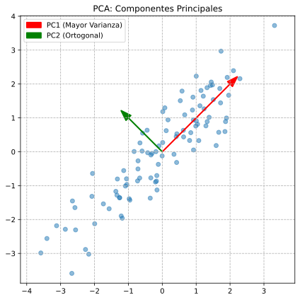

# 📉 Unidad 5. PCA - Análisis de Componentes Principales

El **Análisis de Componentes Principales** (PCA, del inglés *Principal Component Analysis*) es la técnica de **reducción de dimensionalidad** más utilizada en Machine Learning y estadística. PCA transforma los datos a un nuevo sistema de coordenadas donde las primeras dimensiones (componentes principales) capturan la mayor parte de la **varianza** de los datos. Es una técnica fundamental para visualización, compresión de datos y preprocesamiento.



---

## 5.1. ¿Qué es la Reducción de Dimensionalidad?

### El Problema de la Alta Dimensionalidad

En muchos datasets reales, el número de características (dimensiones) puede ser muy alto:
- Imágenes: miles de píxeles
- Texto: miles de palabras
- Genómica: miles de genes
- Finanzas: cientos de indicadores

Esto causa varios problemas:

```
┌─────────────────────────────────────────────────────────────┐
│ PROBLEMAS DE LA ALTA DIMENSIONALIDAD                        │
├─────────────────────────────────────────────────────────────┤
│                                                             │
│ 1. "MALDICIÓN DE LA DIMENSIONALIDAD"                        │
│    - Los datos se vuelven muy dispersos                     │
│    - Las distancias pierden significado                     │
│    - Aumenta el overfitting                                 │
│                                                             │
│ 2. VISUALIZACIÓN IMPOSIBLE                                  │
│    - No podemos visualizar más de 3 dimensiones             │
│                                                             │
│ 3. COSTO COMPUTACIONAL                                      │
│    - Más dimensiones = más tiempo y memoria                 │
│                                                             │
│ 4. MULTICOLINEALIDAD                                        │
│    - Variables correlacionadas = redundancia                │
│                                                             │
└─────────────────────────────────────────────────────────────┘
```

### ¿Qué Hace PCA?

PCA encuentra las direcciones de **máxima varianza** en los datos y proyecta los datos en estas direcciones:

```
Datos originales (2D)         Después de PCA
        │                          │
    y   │    ╱╱╱╱                   │    ────────
        │   ╱╱╱╱                    │    PC1 (máxima varianza)
        │  ╱╱╱╱                     │
        └──────── x                 └────────────
                                    
   Los datos tienen              PC1 captura la dirección
   varianza en diagonal          de máxima dispersión
```

---

## 5.2. Explicación Matemática

### Intuición Geométrica

PCA busca los **ejes de máxima varianza**:
1. Encontrar la dirección donde los datos están más dispersos → PC1
2. Encontrar la siguiente dirección ortogonal con máxima varianza → PC2
3. Repetir hasta tener d componentes (d = dimensiones originales)

### Pasos Matemáticos

#### Paso 1: Centrar los Datos

Restar la media de cada variable para que los datos estén centrados en el origen:

$$X_{centered} = X - \bar{X}$$

Donde $\bar{X}$ es el vector de medias de cada columna.

#### Paso 2: Calcular la Matriz de Covarianza

La matriz de covarianza $\Sigma$ captura las relaciones entre variables:

$$\Sigma = \frac{1}{n-1} X_{centered}^T X_{centered}$$

Para dos variables $x$ y $y$:
$$Cov(x, y) = \frac{1}{n-1} \sum_{i=1}^{n} (x_i - \bar{x})(y_i - \bar{y})$$

La matriz de covarianza es de tamaño $d \times d$ (donde $d$ = número de variables):

$$\Sigma = \begin{bmatrix} Var(x_1) & Cov(x_1, x_2) & \cdots \\ Cov(x_2, x_1) & Var(x_2) & \cdots \\ \vdots & \vdots & \ddots \end{bmatrix}$$

#### Paso 3: Calcular Autovalores y Autovectores

Los **autovectores** de $\Sigma$ son las direcciones de los componentes principales.
Los **autovalores** correspondientes indican cuánta varianza captura cada componente.

$$\Sigma v = \lambda v$$

Donde:
- $v$ = autovector (dirección del componente principal)
- $\lambda$ = autovalor (varianza explicada por ese componente)

#### Paso 4: Ordenar y Seleccionar Componentes

Los componentes se ordenan por autovalor descendente:
- $\lambda_1 \geq \lambda_2 \geq ... \geq \lambda_d$
- PC1 tiene el mayor autovalor, PC2 el segundo, etc.

#### Paso 5: Proyectar los Datos

Para reducir de $d$ dimensiones a $k$ dimensiones:

$$X_{reducido} = X_{centered} \cdot W_k$$

Donde $W_k$ es la matriz de los $k$ primeros autovectores (columnas).

### Varianza Explicada

La **varianza explicada** por cada componente es:

$$\text{Varianza explicada}_i = \frac{\lambda_i}{\sum_{j=1}^{d} \lambda_j}$$

La **varianza acumulada** indica cuánta información total preservamos:

$$\text{Varianza acumulada}_k = \sum_{i=1}^{k} \frac{\lambda_i}{\sum_{j=1}^{d} \lambda_j}$$

---

## 5.3. Pros y Contras

| Ventajas | Desventajas |
| :--- | :--- |
| **Reducción efectiva:** Elimina redundancia y ruido | **Transformación lineal:** No captura relaciones no lineales |
| **Visualización:** Permite visualizar datos de alta dimensión | **Pérdida de información:** Los componentes descartados contienen algo de información |
| **Decorrelación:** Los componentes son ortogonales (no correlacionados) | **Difícil interpretación:** Los componentes son combinaciones de todas las variables |
| **Sin hiperparámetros:** Solo decidir cuántos componentes mantener | **Sensible a escala:** Requiere estandarización previa |
| **Eficiente:** Complejidad $O(nd^2 + d^3)$ | **Sensible a outliers:** Los outliers afectan la dirección de máxima varianza |

---

## 5.4. Ejemplo Básico en Python

Este ejemplo muestra cómo aplicar PCA para visualizar datos de alta dimensión.

```python
# ============================================================
# EJEMPLO BÁSICO: PCA para visualización del dataset Iris
# ============================================================

# Importar bibliotecas necesarias
import numpy as np                          # Operaciones numéricas
import matplotlib.pyplot as plt             # Visualización
from sklearn.decomposition import PCA       # Algoritmo PCA
from sklearn.preprocessing import StandardScaler  # Estandarización
from sklearn.datasets import load_iris      # Dataset de ejemplo

# -------------------------------------------------------------
# 1. CARGAR DATOS
# -------------------------------------------------------------
iris = load_iris()
X = iris.data           # 150 muestras × 4 características
y = iris.target         # Etiquetas de especie
feature_names = iris.feature_names
target_names = iris.target_names

print("="*50)
print("PCA - EJEMPLO BÁSICO CON DATASET IRIS")
print("="*50)
print(f"\nDimensiones originales: {X.shape}")
print(f"Features: {feature_names}")

# -------------------------------------------------------------
# 2. ESTANDARIZAR LOS DATOS (CRUCIAL)
# -------------------------------------------------------------
# PCA es sensible a la escala, por lo que SIEMPRE debemos estandarizar
scaler = StandardScaler()
X_scaled = scaler.fit_transform(X)

print(f"\nDatos estandarizados:")
print(f"  Media por feature: {X_scaled.mean(axis=0).round(4)}")
print(f"  Std por feature: {X_scaled.std(axis=0).round(4)}")

# -------------------------------------------------------------
# 3. APLICAR PCA
# -------------------------------------------------------------
# Reducir de 4 dimensiones a 2 para poder visualizar
pca = PCA(n_components=2)   # Mantener solo 2 componentes

# fit_transform: calcula los componentes y transforma los datos
X_pca = pca.fit_transform(X_scaled)

print(f"\nDimensiones después de PCA: {X_pca.shape}")

# -------------------------------------------------------------
# 4. ANALIZAR LOS COMPONENTES PRINCIPALES
# -------------------------------------------------------------
# explained_variance_ratio_: proporción de varianza explicada por cada componente
print(f"\nVarianza explicada por componente:")
for i, var in enumerate(pca.explained_variance_ratio_):
    print(f"  PC{i+1}: {var*100:.2f}%")
print(f"  Total: {sum(pca.explained_variance_ratio_)*100:.2f}%")

# explained_variance_: autovalores (varianza absoluta)
print(f"\nAutovalores (varianza absoluta):")
for i, var in enumerate(pca.explained_variance_):
    print(f"  PC{i+1}: {var:.4f}")

# components_: autovectores (direcciones de los componentes)
# Cada fila es un componente, cada columna es el peso de esa variable original
print(f"\nAutovectores (componentes_):")
print(f"Formato: [sepal_length, sepal_width, petal_length, petal_width]")
for i, comp in enumerate(pca.components_):
    print(f"  PC{i+1}: {comp.round(4)}")

# -------------------------------------------------------------
# 5. VISUALIZAR LOS DATOS REDUCIDOS
# -------------------------------------------------------------
plt.figure(figsize=(10, 8))

# Crear scatter plot coloreado por especie
colors = ['navy', 'turquoise', 'darkorange']
for i, (color, name) in enumerate(zip(colors, target_names)):
    mask = y == i
    plt.scatter(X_pca[mask, 0], X_pca[mask, 1],
                c=color, label=name, alpha=0.7, edgecolors='w', s=60)

plt.xlabel(f'PC1 ({pca.explained_variance_ratio_[0]*100:.1f}% varianza)', fontsize=12)
plt.ylabel(f'PC2 ({pca.explained_variance_ratio_[1]*100:.1f}% varianza)', fontsize=12)
plt.title('PCA del Dataset Iris (4D → 2D)', fontsize=14)
plt.legend(loc='best')
plt.grid(True, alpha=0.3)

# Añadir vectores de carga (loadings) para interpretar los componentes
# Los loadings muestran cómo contribuye cada variable a cada componente
for i, (var, name) in enumerate(zip(pca.components_.T, feature_names)):
    plt.annotate('', xy=(var[0]*3, var[1]*3), xytext=(0, 0),
                 arrowprops=dict(arrowstyle='->', color='red', lw=2))
    plt.text(var[0]*3.2, var[1]*3.2, name.replace(' (cm)', ''),
             fontsize=10, color='red', ha='center')

plt.tight_layout()
plt.show()

# -------------------------------------------------------------
# 6. INTERPRETACIÓN DE LOS COMPONENTES
# -------------------------------------------------------------
print("\n" + "="*50)
print("INTERPRETACIÓN DE LOS COMPONENTES")
print("="*50)

# Crear DataFrame de loadings para mejor visualización
import pandas as pd
loadings = pd.DataFrame(
    pca.components_.T,
    columns=['PC1', 'PC2'],
    index=feature_names
)
print("\nLoadings (contribución de cada variable):")
print(loadings.round(4))

print("""
Interpretación:
- PC1: Combinación principalmente de petal_length y petal_width (tamaño del pétalo)
       Variables con signos similares y magnitudes altas.
- PC2: Contrasta sepal_width contra las demás (forma del sépalo vs resto)
       sepal_width tiene signo opuesto a las otras variables.
""")
```

---

## 5.5. Ejemplo Avanzado: Selección de Componentes y Reconstrucción

Este ejemplo muestra cómo elegir el número óptimo de componentes y cómo reconstruir los datos.

```python
# ============================================================
# EJEMPLO AVANZADO: PCA completo con análisis de varianza
# ============================================================

import numpy as np
import pandas as pd
import matplotlib.pyplot as plt
from sklearn.decomposition import PCA
from sklearn.preprocessing import StandardScaler
from sklearn.datasets import fetch_openml

# -------------------------------------------------------------
# 1. CARGAR DATOS DE ALTA DIMENSIONALIDAD (MNIST)
# -------------------------------------------------------------
print("="*60)
print("PCA AVANZADO - DATASET MNIST (DÍGITOS)")
print("="*60)
print("\nCargando datos... (puede tardar un momento)")

# Cargar un subconjunto de MNIST para eficiencia
from sklearn.datasets import load_digits
digits = load_digits()
X = digits.data     # 1797 muestras × 64 píxeles (8×8)
y = digits.target

print(f"\nDimensiones originales: {X.shape}")
print(f"Cada imagen es de {int(np.sqrt(X.shape[1]))}×{int(np.sqrt(X.shape[1]))} píxeles")

# -------------------------------------------------------------
# 2. ESTANDARIZAR
# -------------------------------------------------------------
scaler = StandardScaler()
X_scaled = scaler.fit_transform(X)

# -------------------------------------------------------------
# 3. PCA COMPLETO PARA ANÁLISIS DE VARIANZA
# -------------------------------------------------------------
# Primero, ajustar PCA con todos los componentes para analizar varianza
pca_full = PCA()  # n_components=None → todos los componentes
pca_full.fit(X_scaled)

# Varianza explicada por cada componente
var_ratio = pca_full.explained_variance_ratio_
var_cumsum = np.cumsum(var_ratio)

print(f"\nVarianza explicada por los primeros 10 componentes:")
for i in range(10):
    print(f"  PC{i+1}: {var_ratio[i]*100:.2f}% (acumulada: {var_cumsum[i]*100:.2f}%)")

# -------------------------------------------------------------
# 4. VISUALIZAR VARIANZA EXPLICADA
# -------------------------------------------------------------
fig, axes = plt.subplots(1, 2, figsize=(14, 5))

# Gráfico de varianza individual
ax1 = axes[0]
ax1.bar(range(1, len(var_ratio)+1), var_ratio, alpha=0.6, label='Individual')
ax1.set_xlabel('Componente Principal')
ax1.set_ylabel('Proporción de Varianza Explicada')
ax1.set_title('Varianza Explicada por Componente')
ax1.set_xlim([0, 30])
ax1.legend()
ax1.grid(True, alpha=0.3)

# Gráfico de varianza acumulada
ax2 = axes[1]
ax2.plot(range(1, len(var_cumsum)+1), var_cumsum, 'bo-', markersize=4)
ax2.axhline(y=0.90, color='r', linestyle='--', label='90% varianza')
ax2.axhline(y=0.95, color='g', linestyle='--', label='95% varianza')
ax2.axhline(y=0.99, color='orange', linestyle='--', label='99% varianza')

# Encontrar número de componentes para diferentes umbrales
n_90 = np.argmax(var_cumsum >= 0.90) + 1
n_95 = np.argmax(var_cumsum >= 0.95) + 1
n_99 = np.argmax(var_cumsum >= 0.99) + 1

ax2.axvline(x=n_90, color='r', linestyle=':', alpha=0.5)
ax2.axvline(x=n_95, color='g', linestyle=':', alpha=0.5)
ax2.axvline(x=n_99, color='orange', linestyle=':', alpha=0.5)

ax2.set_xlabel('Número de Componentes')
ax2.set_ylabel('Varianza Acumulada')
ax2.set_title('Varianza Acumulada')
ax2.legend(loc='lower right')
ax2.grid(True, alpha=0.3)
ax2.set_xlim([0, 64])

plt.tight_layout()
plt.show()

print(f"\nComponentes necesarios para:")
print(f"  90% varianza: {n_90} componentes")
print(f"  95% varianza: {n_95} componentes")
print(f"  99% varianza: {n_99} componentes")

# -------------------------------------------------------------
# 5. REDUCCIÓN A 2D PARA VISUALIZACIÓN
# -------------------------------------------------------------
pca_2d = PCA(n_components=2)
X_2d = pca_2d.fit_transform(X_scaled)

plt.figure(figsize=(12, 10))
scatter = plt.scatter(X_2d[:, 0], X_2d[:, 1], c=y, cmap='tab10',
                      alpha=0.6, edgecolors='w', s=20)
plt.xlabel(f'PC1 ({pca_2d.explained_variance_ratio_[0]*100:.1f}%)')
plt.ylabel(f'PC2 ({pca_2d.explained_variance_ratio_[1]*100:.1f}%)')
plt.title('Dígitos MNIST Proyectados a 2D con PCA')
plt.colorbar(scatter, label='Dígito')
plt.grid(True, alpha=0.3)
plt.show()

# -------------------------------------------------------------
# 6. RECONSTRUCCIÓN DE IMÁGENES
# -------------------------------------------------------------
print("\n" + "="*60)
print("RECONSTRUCCIÓN DE IMÁGENES")
print("="*60)

# Función para reconstruir y visualizar
def reconstruct_and_show(X, pca, scaler, n_components_list, sample_idx=0):
    """
    Reconstruye una imagen con diferente número de componentes.
    """
    original = X[sample_idx].reshape(8, 8)
    
    fig, axes = plt.subplots(1, len(n_components_list)+1, figsize=(15, 3))
    
    # Imagen original
    axes[0].imshow(original, cmap='gray')
    axes[0].set_title(f'Original\n(64 dims)')
    axes[0].axis('off')
    
    X_sample = X[sample_idx:sample_idx+1]
    X_scaled = scaler.transform(X_sample)
    
    for i, n_comp in enumerate(n_components_list):
        # Ajustar PCA con n componentes
        pca_temp = PCA(n_components=n_comp)
        pca_temp.fit(scaler.transform(X))
        
        # Transformar y reconstruir
        X_reduced = pca_temp.transform(X_scaled)
        X_reconstructed = pca_temp.inverse_transform(X_reduced)
        X_reconstructed = scaler.inverse_transform(X_reconstructed)
        
        # Calcular error de reconstrucción
        mse = np.mean((X_sample - X_reconstructed)**2)
        
        # Mostrar
        axes[i+1].imshow(X_reconstructed.reshape(8, 8), cmap='gray')
        axes[i+1].set_title(f'{n_comp} componentes\nMSE: {mse:.2f}')
        axes[i+1].axis('off')
    
    plt.suptitle('Reconstrucción con Diferente Número de Componentes', fontsize=14)
    plt.tight_layout()
    plt.show()

# Reconstruir el primer dígito con diferentes componentes
n_components_list = [2, 5, 10, 20, 40]
reconstruct_and_show(X, pca_full, scaler, n_components_list, sample_idx=0)

print("\nObservación: Con ~20 componentes ya se obtiene una buena reconstrucción")
print("del dígito original, a pesar de reducir de 64 a 20 dimensiones (~70% compresión)")

# -------------------------------------------------------------
# 7. VISUALIZAR LOS COMPONENTES PRINCIPALES (EIGENFACES)
# -------------------------------------------------------------
print("\n" + "="*60)
print("COMPONENTES PRINCIPALES COMO IMÁGENES")
print("="*60)

fig, axes = plt.subplots(2, 5, figsize=(15, 6))
axes = axes.flatten()

for i in range(10):
    # Cada componente se puede visualizar como una imagen
    component = pca_full.components_[i].reshape(8, 8)
    axes[i].imshow(component, cmap='RdBu')
    axes[i].set_title(f'PC{i+1}\n({var_ratio[i]*100:.1f}%)')
    axes[i].axis('off')

plt.suptitle('Primeros 10 Componentes Principales (como imágenes 8×8)', fontsize=14)
plt.tight_layout()
plt.show()

print("Los primeros componentes capturan patrones globales (bordes, formas)")
print("Los componentes posteriores capturan detalles más finos")

# -------------------------------------------------------------
# 8. PCA COMO PREPROCESAMIENTO PARA CLASIFICACIÓN
# -------------------------------------------------------------
print("\n" + "="*60)
print("PCA COMO PREPROCESAMIENTO PARA ML")
print("="*60)

from sklearn.model_selection import train_test_split
from sklearn.neighbors import KNeighborsClassifier
from sklearn.metrics import accuracy_score
import time

# Dividir datos
X_train, X_test, y_train, y_test = train_test_split(
    X_scaled, y, test_size=0.3, random_state=42
)

# Comparar rendimiento con diferentes niveles de reducción
results = []

for n_comp in [None, 40, 20, 10, 5, 2]:
    if n_comp is None:
        # Sin reducción
        X_train_pca = X_train
        X_test_pca = X_test
        n_dims = X_train.shape[1]
    else:
        # Con PCA
        pca = PCA(n_components=n_comp)
        X_train_pca = pca.fit_transform(X_train)
        X_test_pca = pca.transform(X_test)
        n_dims = n_comp
    
    # Entrenar clasificador
    knn = KNeighborsClassifier(n_neighbors=5)
    
    start_time = time.time()
    knn.fit(X_train_pca, y_train)
    y_pred = knn.predict(X_test_pca)
    elapsed = time.time() - start_time
    
    acc = accuracy_score(y_test, y_pred)
    
    results.append({
        'Dimensiones': n_dims,
        'Accuracy': acc,
        'Tiempo (s)': elapsed
    })

df_results = pd.DataFrame(results)
print("\nRendimiento de KNN con diferentes niveles de reducción:")
print(df_results.to_string(index=False))

# Visualizar
fig, ax = plt.subplots(figsize=(10, 6))
ax.plot(df_results['Dimensiones'], df_results['Accuracy'], 'bo-', markersize=10)
ax.set_xlabel('Número de Dimensiones (componentes)')
ax.set_ylabel('Accuracy')
ax.set_title('Accuracy vs Dimensionalidad (KNN con PCA)')
ax.invert_xaxis()  # Invertir eje x para mejor lectura
ax.grid(True, alpha=0.3)
plt.show()

print("""
Conclusión:
- PCA puede reducir significativamente las dimensiones manteniendo buen rendimiento
- Menos dimensiones = entrenamiento/predicción más rápido
- Hay un punto óptimo donde reducimos complejidad sin perder mucha precisión
""")

# -------------------------------------------------------------
# 9. PCA INCREMENTAL PARA DATASETS GRANDES
# -------------------------------------------------------------
print("\n" + "="*60)
print("VARIANTES DE PCA")
print("="*60)

print("""
scikit-learn ofrece varias implementaciones de PCA:

1. PCA (estándar):
   - Usa SVD completo
   - Para datasets que caben en memoria
   - from sklearn.decomposition import PCA

2. IncrementalPCA:
   - Procesa datos en batches
   - Para datasets muy grandes que no caben en memoria
   - from sklearn.decomposition import IncrementalPCA

3. SparsePCA:
   - Produce componentes con muchos ceros (sparse)
   - Mejor interpretabilidad
   - from sklearn.decomposition import SparsePCA

4. KernelPCA:
   - PCA no lineal usando kernels
   - Para relaciones no lineales en los datos
   - from sklearn.decomposition import KernelPCA
""")

# Ejemplo de KernelPCA
from sklearn.decomposition import KernelPCA
from sklearn.datasets import make_moons

# Datos no linealmente separables
X_moons, y_moons = make_moons(n_samples=200, noise=0.05, random_state=42)

fig, axes = plt.subplots(1, 3, figsize=(15, 4))

# Original
axes[0].scatter(X_moons[:, 0], X_moons[:, 1], c=y_moons, cmap='viridis')
axes[0].set_title('Datos Originales')

# PCA lineal
pca_linear = PCA(n_components=2)
X_pca_linear = pca_linear.fit_transform(X_moons)
axes[1].scatter(X_pca_linear[:, 0], X_pca_linear[:, 1], c=y_moons, cmap='viridis')
axes[1].set_title('PCA Lineal (igual que original)')

# Kernel PCA (RBF)
kpca = KernelPCA(n_components=2, kernel='rbf', gamma=15)
X_kpca = kpca.fit_transform(X_moons)
axes[2].scatter(X_kpca[:, 0], X_kpca[:, 1], c=y_moons, cmap='viridis')
axes[2].set_title('Kernel PCA (RBF)')

plt.tight_layout()
plt.show()

print("KernelPCA puede capturar relaciones no lineales que PCA estándar no puede")

print("\n" + "="*60)
print("ANÁLISIS COMPLETADO")
print("="*60)
```

---

## 5.6. Hiperparámetros de PCA en scikit-learn

| Parámetro | Descripción | Valores | Recomendación |
| :--- | :--- | :--- | :--- |
| `n_components` | Número de componentes a mantener | int, float, 'mle', None | Ver nota abajo |
| `svd_solver` | Algoritmo para calcular SVD | 'auto', 'full', 'arpack', 'randomized' | 'auto' para la mayoría de casos |
| `whiten` | Si blanquear los datos (varianza unitaria) | True/False | True si se usa para clasificación |
| `random_state` | Semilla para svd_solver='randomized' | int o None | Fijar para reproducibilidad |

### Especificar `n_components`

```python
# Formas de especificar n_components:

# 1. Número exacto de componentes
pca = PCA(n_components=10)  # Exactamente 10 componentes

# 2. Proporción de varianza a preservar (0-1)
pca = PCA(n_components=0.95)  # Componentes para retener 95% de varianza

# 3. Estimación automática con MLE
pca = PCA(n_components='mle')  # Estimación de máxima verosimilitud

# 4. Todos los componentes
pca = PCA(n_components=None)  # min(n_samples, n_features) componentes
```

---

## 5.7. Aplicaciones Reales de PCA

### 1. Compresión de Imágenes

* **Eigenfaces:** Reconocimiento facial con dimensionalidad reducida
* [Tutorial: Eigenfaces](https://scikit-learn.org/stable/auto_examples/applications/plot_face_recognition.html)

### 2. Visualización de Datos

Proyectar datos de alta dimensión a 2D/3D para exploración.

### 3. Preprocesamiento para ML

- Reducir overfitting al eliminar features redundantes
- Acelerar el entrenamiento de modelos
- Eliminar multicolinealidad

### 4. Análisis de Expresión Génica

Identificar genes importantes y visualizar grupos de muestras.

### 5. Finanzas

- Análisis de portafolio (factores de riesgo)
- Detección de patrones en series financieras
* [Tutorial: PCA in Finance](https://www.kaggle.com/code/arthurtok/pca-and-eigenportfolios)

---

## 5.8. PCA vs Otras Técnicas

| Técnica | Tipo | Preserva | Mejor para |
| :--- | :--- | :--- | :--- |
| **PCA** | Lineal | Varianza global | Datos lineales, preprocesamiento |
| **t-SNE** | No lineal | Estructura local | Visualización de clusters |
| **UMAP** | No lineal | Estructura local + global | Visualización + ML |
| **LDA** | Supervisado | Separabilidad de clases | Clasificación |
| **Autoencoders** | No lineal | Representación aprendida | Relaciones complejas |

---

## 5.9. Resumen y Mejores Prácticas

### Checklist para usar PCA

- [ ] **Estandarizar los datos** (StandardScaler) - ¡Obligatorio!
- [ ] **Analizar la varianza explicada** para elegir n_components
- [ ] **Usar 95% de varianza** como regla general
- [ ] **Visualizar loadings** para interpretar componentes
- [ ] **Verificar** que la reducción no afecta negativamente el modelo downstream
- [ ] **Considerar alternativas no lineales** si PCA no funciona bien

### ¿Cuándo usar PCA?

✅ **Usar PCA cuando:**
- Los datos tienen alta dimensionalidad
- Hay multicolinealidad entre variables
- Necesitas visualizar datos multidimensionales
- Quieres preprocesar para acelerar ML
- Las relaciones son aproximadamente lineales

❌ **Considerar alternativas cuando:**
- Las relaciones son altamente no lineales → Kernel PCA, Autoencoders
- Necesitas visualización con clusters claros → t-SNE, UMAP
- Tienes un problema de clasificación → LDA

---

📅 **Fecha de creación:** Enero 2026  
✍️ **Autor:** Fran García
