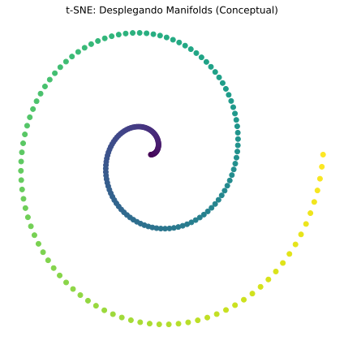

# 🔮 Unidad 6. t-SNE - Visualización de Alta Dimensión

**t-SNE** (t-distributed Stochastic Neighbor Embedding) es una técnica de **reducción de dimensionalidad no lineal** diseñada específicamente para **visualización** de datos de alta dimensión. A diferencia de PCA que preserva la varianza global, t-SNE se enfoca en preservar la **estructura local**: los puntos que son similares en el espacio original permanecen cercanos en el espacio reducido. Esto lo hace excepcional para revelar clusters y patrones ocultos.



---

## 6.1. ¿Por Qué t-SNE?

### Limitaciones de PCA

PCA es una técnica lineal que preserva la varianza global. Sin embargo:
- No captura relaciones no lineales
- No preserva bien la estructura de clusters
- Los datos proyectados pueden solaparse incluso si los clusters originales están bien separados

### La Idea de t-SNE

t-SNE se pregunta: *"¿Cómo puedo proyectar los datos de manera que los vecinos cercanos en alta dimensión sigan siendo vecinos cercanos en baja dimensión?"*

```
┌─────────────────────────────────────────────────────────────┐
│ INTUICIÓN DE t-SNE                                          │
├─────────────────────────────────────────────────────────────┤
│                                                             │
│ Espacio Original (Alta Dimensión)                           │
│                                                             │
│     A está cerca de B y C                                   │
│     A está lejos de X e Y                                   │
│                                                             │
│              A ● ● B                                        │
│                ● C                                          │
│                                                             │
│                           X ● ● Y                           │
│                                                             │
│ ─────────────────────────────────────────────────────────── │
│                                                             │
│ t-SNE preserva estas relaciones de vecindad:                │
│                                                             │
│ Espacio Reducido (2D)                                       │
│                                                             │
│         ●A ●B               ●X                              │
│          ●C                  ●Y                             │
│                                                             │
│ ✓ A sigue cerca de B y C                                   │
│ ✓ A sigue lejos de X e Y                                   │
│ ✓ Clusters visualmente separados                            │
│                                                             │
└─────────────────────────────────────────────────────────────┘
```

---

## 6.2. Explicación Matemática

### Paso 1: Calcular Similitudes en Alta Dimensión

Para cada par de puntos $(x_i, x_j)$ en el espacio original, t-SNE calcula una **probabilidad condicional** $p_{j|i}$ que representa qué tan probable es que $x_i$ elija a $x_j$ como su vecino si los vecinos se eligieran proporcionalmente a una distribución Gaussiana centrada en $x_i$:

$$p_{j|i} = \frac{\exp(-||x_i - x_j||^2 / 2\sigma_i^2)}{\sum_{k \neq i} \exp(-||x_i - x_k||^2 / 2\sigma_i^2)}$$

Donde $\sigma_i$ es la varianza de la Gaussiana centrada en $x_i$ (se ajusta automáticamente según el parámetro **perplexity**).

Las probabilidades se simetrizan:
$$p_{ij} = \frac{p_{j|i} + p_{i|j}}{2n}$$

### Paso 2: Calcular Similitudes en Baja Dimensión

En el espacio reducido, t-SNE usa una **distribución t de Student** (con 1 grado de libertad, es decir, distribución de Cauchy) en lugar de Gaussiana:

$$q_{ij} = \frac{(1 + ||y_i - y_j||^2)^{-1}}{\sum_{k \neq l}(1 + ||y_k - y_l||^2)^{-1}}$$

Donde $y_i$ y $y_j$ son las representaciones en baja dimensión.

### ¿Por Qué la Distribución t?

La distribución t tiene **colas más pesadas** que la Gaussiana:

```
          Gaussiana          Distribución t
             ___                  ___
            /   \               /     \
           /     \             /       \
          /       \           /         \
      ___/         \___     _/           \_
           ────────              ──────────
         Colas ligeras       Colas pesadas
```

Esto resuelve el **problema del amontonamiento (crowding problem)**:
- En alta dimensión hay mucho "espacio" para que los puntos se dispersen
- En baja dimensión hay menos espacio
- Las colas pesadas permiten que puntos moderadamente lejanos se separen más, dejando espacio para los clusters

### Paso 3: Minimizar la Divergencia KL

t-SNE minimiza la **divergencia de Kullback-Leibler** entre las distribuciones P (alta dim) y Q (baja dim):

$$KL(P||Q) = \sum_{i \neq j} p_{ij} \log \frac{p_{ij}}{q_{ij}}$$

Esta función de costo penaliza fuertemente cuando:
- Puntos cercanos en alta dimensión ($p_{ij}$ alto) quedan lejos en baja dimensión ($q_{ij}$ bajo)

La minimización se hace mediante **descenso de gradiente**.

### El Parámetro Perplexity

La **perplexity** es el hiperparámetro más importante de t-SNE. Intuitivamente, es una medida del número efectivo de vecinos cercanos:

$$Perplexity = 2^{H(P_i)}$$

Donde $H(P_i)$ es la entropía de Shannon de la distribución de probabilidad centrada en $x_i$.

- **Perplexity baja (5-10):** Solo considera vecinos muy cercanos → estructura muy local
- **Perplexity alta (30-50):** Considera más vecinos → estructura más global
- **Regla:** Debe ser menor que el número de puntos

---

## 6.3. Pros y Contras

| Ventajas | Desventajas |
| :--- | :--- |
| **Excelente para visualización:** Revela clusters claramente | **Solo para visualización:** No usar para preprocesamiento de ML |
| **Preserva estructura local:** Vecinos cercanos permanecen juntos | **Lento:** Complejidad $O(n^2)$, aunque hay aproximaciones |
| **No lineal:** Captura relaciones complejas | **No determinístico:** Diferentes ejecuciones dan diferentes resultados |
| **Funciona bien con clusters:** Separa grupos visualmente | **Distancias no interpretables:** Las distancias entre clusters no tienen significado |
| **Hiperparámetros simples:** Principalmente perplexity | **Sensible a hiperparámetros:** Perplexity afecta mucho el resultado |

---

## 6.4. Ejemplo Básico en Python

Este ejemplo muestra el uso básico de t-SNE para visualizar el dataset de dígitos.

```python
# ============================================================
# EJEMPLO BÁSICO: t-SNE para visualización de dígitos
# ============================================================

# Importar bibliotecas necesarias
import numpy as np                          # Operaciones numéricas
import matplotlib.pyplot as plt             # Visualización
from sklearn.manifold import TSNE           # Algoritmo t-SNE
from sklearn.preprocessing import StandardScaler  # Estandarización
from sklearn.datasets import load_digits    # Dataset de dígitos

# -------------------------------------------------------------
# 1. CARGAR DATOS
# -------------------------------------------------------------
digits = load_digits()
X = digits.data     # 1797 muestras × 64 características (8×8 píxeles)
y = digits.target   # Etiquetas de dígitos (0-9)

print("="*50)
print("t-SNE - EJEMPLO BÁSICO CON DÍGITOS")
print("="*50)
print(f"\nDimensiones originales: {X.shape}")
print(f"Clases: {np.unique(y)}")

# -------------------------------------------------------------
# 2. ESTANDARIZAR LOS DATOS
# -------------------------------------------------------------
# Aunque t-SNE es robusto a la escala, es buena práctica estandarizar
scaler = StandardScaler()
X_scaled = scaler.fit_transform(X)

# -------------------------------------------------------------
# 3. APLICAR t-SNE
# -------------------------------------------------------------
# Reducir de 64 dimensiones a 2 para visualización
print("\nAplicando t-SNE (puede tardar un momento)...")

tsne = TSNE(
    n_components=2,         # Reducir a 2 dimensiones
    perplexity=30,          # Número efectivo de vecinos (típico: 5-50)
    random_state=42,        # Reproducibilidad
    n_iter=1000,            # Número de iteraciones de optimización
    learning_rate='auto'    # Tasa de aprendizaje automática
)

# fit_transform: ajusta el modelo y transforma los datos
X_tsne = tsne.fit_transform(X_scaled)

print(f"Dimensiones después de t-SNE: {X_tsne.shape}")
print(f"Divergencia KL final: {tsne.kl_divergence_:.4f}")

# -------------------------------------------------------------
# 4. VISUALIZAR RESULTADOS
# -------------------------------------------------------------
plt.figure(figsize=(12, 10))

# Crear scatter plot con colores por dígito
scatter = plt.scatter(
    X_tsne[:, 0], X_tsne[:, 1],
    c=y,                    # Color según el dígito
    cmap='tab10',           # Paleta de 10 colores
    alpha=0.7,              # Transparencia
    edgecolors='w',         # Borde blanco
    s=30                    # Tamaño de puntos
)

# Añadir etiquetas en los centroides de cada cluster
for digit in range(10):
    mask = y == digit
    centroid = X_tsne[mask].mean(axis=0)
    plt.annotate(
        str(digit),
        centroid,
        fontsize=20,
        fontweight='bold',
        ha='center',
        va='center',
        color='black',
        bbox=dict(boxstyle='circle', facecolor='white', alpha=0.8)
    )

plt.xlabel('t-SNE Dimensión 1', fontsize=12)
plt.ylabel('t-SNE Dimensión 2', fontsize=12)
plt.title('Visualización de Dígitos con t-SNE (64D → 2D)', fontsize=14)
plt.colorbar(scatter, label='Dígito')
plt.grid(True, alpha=0.3)
plt.show()

# -------------------------------------------------------------
# 5. COMPARAR CON PCA
# -------------------------------------------------------------
from sklearn.decomposition import PCA

# Aplicar PCA para comparación
pca = PCA(n_components=2)
X_pca = pca.fit_transform(X_scaled)

# Comparar visualizaciones
fig, axes = plt.subplots(1, 2, figsize=(16, 6))

# PCA
scatter1 = axes[0].scatter(X_pca[:, 0], X_pca[:, 1], c=y, cmap='tab10',
                           alpha=0.7, edgecolors='w', s=20)
axes[0].set_xlabel('PC1')
axes[0].set_ylabel('PC2')
axes[0].set_title('PCA (lineal) - Dígitos')
plt.colorbar(scatter1, ax=axes[0])

# t-SNE
scatter2 = axes[1].scatter(X_tsne[:, 0], X_tsne[:, 1], c=y, cmap='tab10',
                           alpha=0.7, edgecolors='w', s=20)
axes[1].set_xlabel('t-SNE 1')
axes[1].set_ylabel('t-SNE 2')
axes[1].set_title('t-SNE (no lineal) - Dígitos')
plt.colorbar(scatter2, ax=axes[1])

plt.tight_layout()
plt.show()

print("""
Observaciones:
- t-SNE separa claramente los clusters de dígitos
- PCA muestra más solapamiento entre clases
- t-SNE es superior para visualizar estructura de clusters
- Las distancias en t-SNE no son interpretables (solo la estructura)
""")
```

---

## 6.5. Ejemplo Avanzado: Efecto de Hiperparámetros y Buenas Prácticas

Este ejemplo explora el efecto de la perplexity y otros parámetros.

```python
# ============================================================
# EJEMPLO AVANZADO: Análisis de hiperparámetros de t-SNE
# ============================================================

import numpy as np
import matplotlib.pyplot as plt
from sklearn.manifold import TSNE
from sklearn.preprocessing import StandardScaler
from sklearn.datasets import load_digits
import time

# -------------------------------------------------------------
# 1. CARGAR Y PREPARAR DATOS
# -------------------------------------------------------------
digits = load_digits()
X = digits.data
y = digits.target

scaler = StandardScaler()
X_scaled = scaler.fit_transform(X)

print("="*60)
print("ANÁLISIS DE HIPERPARÁMETROS DE t-SNE")
print("="*60)

# -------------------------------------------------------------
# 2. EFECTO DE LA PERPLEXITY
# -------------------------------------------------------------
print("\n[1] EFECTO DE LA PERPLEXITY")
print("-"*40)

perplexities = [5, 15, 30, 50, 100]

fig, axes = plt.subplots(1, len(perplexities), figsize=(20, 4))

for i, perp in enumerate(perplexities):
    print(f"  Calculando perplexity={perp}...", end=" ")
    start = time.time()
    
    tsne = TSNE(n_components=2, perplexity=perp, random_state=42,
                n_iter=1000, learning_rate='auto')
    X_tsne = tsne.fit_transform(X_scaled)
    
    elapsed = time.time() - start
    print(f"({elapsed:.1f}s)")
    
    axes[i].scatter(X_tsne[:, 0], X_tsne[:, 1], c=y, cmap='tab10',
                    alpha=0.6, s=10, edgecolors='none')
    axes[i].set_title(f'Perplexity = {perp}')
    axes[i].set_xticks([])
    axes[i].set_yticks([])

plt.suptitle('Efecto de la Perplexity en t-SNE', fontsize=14, y=1.02)
plt.tight_layout()
plt.show()

print("""
Interpretación de Perplexity:
- Perplexity baja (5-10): Estructura muy local, clusters pequeños
- Perplexity media (30): Balance entre local y global (recomendado)
- Perplexity alta (50-100): Estructura más global, clusters más grandes
- Perplexity > n_samples/3 puede causar problemas
""")

# -------------------------------------------------------------
# 3. EFECTO DEL NÚMERO DE ITERACIONES
# -------------------------------------------------------------
print("\n[2] EFECTO DEL NÚMERO DE ITERACIONES")
print("-"*40)

n_iters = [250, 500, 1000, 2000]

fig, axes = plt.subplots(1, len(n_iters), figsize=(16, 4))

for i, n_iter in enumerate(n_iters):
    print(f"  Calculando n_iter={n_iter}...", end=" ")
    start = time.time()
    
    tsne = TSNE(n_components=2, perplexity=30, random_state=42,
                n_iter=n_iter, learning_rate='auto')
    X_tsne = tsne.fit_transform(X_scaled)
    
    elapsed = time.time() - start
    print(f"KL={tsne.kl_divergence_:.4f} ({elapsed:.1f}s)")
    
    axes[i].scatter(X_tsne[:, 0], X_tsne[:, 1], c=y, cmap='tab10',
                    alpha=0.6, s=10, edgecolors='none')
    axes[i].set_title(f'n_iter={n_iter}\nKL={tsne.kl_divergence_:.3f}')
    axes[i].set_xticks([])
    axes[i].set_yticks([])

plt.suptitle('Efecto del Número de Iteraciones', fontsize=14, y=1.02)
plt.tight_layout()
plt.show()

print("""
Interpretación:
- Muy pocas iteraciones: t-SNE no converge (estructura incompleta)
- 1000 iteraciones suele ser suficiente para la mayoría de casos
- Más iteraciones mejoran hasta un punto, luego estabilizan
""")

# -------------------------------------------------------------
# 4. ESTABILIDAD: MÚLTIPLES EJECUCIONES
# -------------------------------------------------------------
print("\n[3] ESTABILIDAD DE t-SNE")
print("-"*40)

fig, axes = plt.subplots(1, 4, figsize=(16, 4))

for i in range(4):
    # Diferentes random_state
    tsne = TSNE(n_components=2, perplexity=30, random_state=i*10,
                n_iter=1000, learning_rate='auto')
    X_tsne = tsne.fit_transform(X_scaled)
    
    axes[i].scatter(X_tsne[:, 0], X_tsne[:, 1], c=y, cmap='tab10',
                    alpha=0.6, s=10, edgecolors='none')
    axes[i].set_title(f'random_state={i*10}')
    axes[i].set_xticks([])
    axes[i].set_yticks([])

plt.suptitle('Diferentes Inicializaciones de t-SNE', fontsize=14, y=1.02)
plt.tight_layout()
plt.show()

print("""
Observaciones sobre estabilidad:
- t-SNE NO es determinístico (diferente resultado cada vez)
- Los CLUSTERS se preservan, pero su POSICIÓN y ORIENTACIÓN cambian
- No comparar posiciones entre diferentes ejecuciones
- Usar random_state fijo para reproducibilidad
""")

# -------------------------------------------------------------
# 5. INICIALIZACIÓN CON PCA
# -------------------------------------------------------------
print("\n[4] INICIALIZACIÓN CON PCA (Recomendado)")
print("-"*40)

fig, axes = plt.subplots(1, 2, figsize=(14, 5))

# Sin inicialización PCA
tsne_random = TSNE(n_components=2, perplexity=30, random_state=42,
                   n_iter=1000, init='random', learning_rate='auto')
X_tsne_random = tsne_random.fit_transform(X_scaled)

# Con inicialización PCA
tsne_pca = TSNE(n_components=2, perplexity=30, random_state=42,
                n_iter=1000, init='pca', learning_rate='auto')
X_tsne_pca = tsne_pca.fit_transform(X_scaled)

axes[0].scatter(X_tsne_random[:, 0], X_tsne_random[:, 1], c=y, 
                cmap='tab10', alpha=0.6, s=15)
axes[0].set_title(f"init='random'\nKL={tsne_random.kl_divergence_:.4f}")
axes[0].set_xticks([])
axes[0].set_yticks([])

axes[1].scatter(X_tsne_pca[:, 0], X_tsne_pca[:, 1], c=y,
                cmap='tab10', alpha=0.6, s=15)
axes[1].set_title(f"init='pca' (recomendado)\nKL={tsne_pca.kl_divergence_:.4f}")
axes[1].set_xticks([])
axes[1].set_yticks([])

plt.suptitle('Efecto de la Inicialización', fontsize=14)
plt.tight_layout()
plt.show()

print("""
init='pca' es recomendado porque:
- Más reproducible
- Convergencia más rápida
- Mejor preservación de la estructura global
""")

# -------------------------------------------------------------
# 6. t-SNE CON DATOS GRANDES (Barnes-Hut)
# -------------------------------------------------------------
print("\n[5] ESCALABILIDAD: Barnes-Hut vs Exact")
print("-"*40)

print("""
Para datasets grandes, usar method='barnes_hut':
- Complejidad: O(n²) → O(n log n)
- Aproximación del algoritmo exacto
- Por defecto cuando n_samples > 10000
""")

# Ejemplo con datos más grandes
from sklearn.datasets import make_blobs
X_large, y_large = make_blobs(n_samples=5000, n_features=50, centers=10, random_state=42)
X_large_scaled = StandardScaler().fit_transform(X_large)

# Barnes-Hut (aproximado)
print("  Barnes-Hut (aproximado)...", end=" ")
start = time.time()
tsne_bh = TSNE(n_components=2, perplexity=30, method='barnes_hut', 
               random_state=42, n_iter=1000)
X_bh = tsne_bh.fit_transform(X_large_scaled)
print(f"{time.time()-start:.1f}s")

# Exact (para comparación - será más lento)
print("  Exact...", end=" ")
start = time.time()
tsne_exact = TSNE(n_components=2, perplexity=30, method='exact',
                  random_state=42, n_iter=1000)
X_exact = tsne_exact.fit_transform(X_large_scaled)
print(f"{time.time()-start:.1f}s")

fig, axes = plt.subplots(1, 2, figsize=(14, 5))

axes[0].scatter(X_bh[:, 0], X_bh[:, 1], c=y_large, cmap='tab10', alpha=0.5, s=5)
axes[0].set_title("method='barnes_hut' (Rápido)")

axes[1].scatter(X_exact[:, 0], X_exact[:, 1], c=y_large, cmap='tab10', alpha=0.5, s=5)
axes[1].set_title("method='exact' (Preciso)")

plt.suptitle('Comparación de Métodos para n=5000', fontsize=14)
plt.tight_layout()
plt.show()

# -------------------------------------------------------------
# 7. INTERPRETACIÓN CORRECTA DE t-SNE
# -------------------------------------------------------------
print("\n" + "="*60)
print("CÓMO INTERPRETAR (Y NO INTERPRETAR) t-SNE")
print("="*60)

print("""
✅ LO QUE SÍ PUEDES INTERPRETAR:
   - La existencia de clusters separados
   - Puntos cercanos en t-SNE → similares en alta dimensión
   - Estructura general de los datos

❌ LO QUE NO PUEDES INTERPRETAR:
   - Tamaño de los clusters (distorsionado)
   - Distancia entre clusters (no tiene significado)
   - Densidad de los clusters
   - Posición absoluta (rotación/reflejo arbitrarios)

⚠️ ERRORES COMUNES:
   1. "El cluster A es más grande que B" → FALSO
   2. "Los clusters A y B están más cerca que A y C" → PUEDE SER FALSO
   3. "Hay más densidad en esta región" → NO NECESARIAMENTE
   4. Usar t-SNE como preprocesamiento para ML → NO RECOMENDADO
""")

# Demostración del problema de distancias entre clusters
print("\n[Demostración: Distancias entre clusters NO son confiables]")

# Crear datos con distancias conocidas
from sklearn.datasets import make_blobs
centers = [[0, 0], [10, 0], [100, 0]]  # Distancias 10 y 90
X_demo, y_demo = make_blobs(n_samples=300, centers=centers, 
                            cluster_std=1, random_state=42)

# Aplicar t-SNE
tsne_demo = TSNE(n_components=2, perplexity=30, random_state=42)
X_demo_tsne = tsne_demo.fit_transform(X_demo)

fig, axes = plt.subplots(1, 2, figsize=(14, 5))

# Espacio original
axes[0].scatter(X_demo[:, 0], X_demo[:, 1], c=y_demo, cmap='tab10', alpha=0.7)
axes[0].set_title('Espacio Original\nDistancias: A-B=10, B-C=90')
axes[0].set_xlabel('X')
axes[0].set_ylabel('Y')

# Espacio t-SNE
axes[1].scatter(X_demo_tsne[:, 0], X_demo_tsne[:, 1], c=y_demo, cmap='tab10', alpha=0.7)
axes[1].set_title('Espacio t-SNE\n¿Se preservan las distancias relativas?')
axes[1].set_xlabel('t-SNE 1')
axes[1].set_ylabel('t-SNE 2')

plt.tight_layout()
plt.show()

print("""
Conclusión: Las distancias relativas entre clusters NO se preservan en t-SNE
El cluster C que estaba 9x más lejos puede aparecer a distancia similar en t-SNE
""")

# -------------------------------------------------------------
# 8. RESUMEN DE MEJORES PRÁCTICAS
# -------------------------------------------------------------
print("\n" + "="*60)
print("MEJORES PRÁCTICAS PARA t-SNE")
print("="*60)

print("""
1. PREPROCESAMIENTO:
   - Siempre estandarizar (StandardScaler)
   - Considerar reducir con PCA primero si dim > 50

2. HIPERPARÁMETROS:
   - perplexity: 5-50, típicamente 30
   - n_iter: al menos 1000, verificar convergencia (KL divergence)
   - learning_rate: 'auto' o n_samples/12
   - init: 'pca' para mayor reproducibilidad

3. VISUALIZACIÓN:
   - No confiar en tamaños de clusters
   - No confiar en distancias entre clusters
   - Ejecutar varias veces para verificar estabilidad

4. NO USAR PARA:
   - Preprocesamiento de ML
   - Clustering (usar los datos originales)
   - Comparar posiciones entre diferentes ejecuciones
""")

print("\n" + "="*60)
print("ANÁLISIS COMPLETADO")
print("="*60)
```

---

## 6.6. Hiperparámetros de t-SNE en scikit-learn

| Parámetro | Descripción | Valores | Recomendación |
| :--- | :--- | :--- | :--- |
| `n_components` | Dimensiones de salida | 2 o 3 | 2 para visualización |
| `perplexity` | Número efectivo de vecinos | 5-50 | 30 es un buen inicio |
| `learning_rate` | Tasa de aprendizaje | 'auto', 10-1000 | 'auto' (n_samples/12) |
| `n_iter` | Número de iteraciones | int > 0 | 1000 mínimo |
| `init` | Inicialización | 'random', 'pca' | 'pca' para reproducibilidad |
| `method` | Algoritmo | 'barnes_hut', 'exact' | 'barnes_hut' si n > 10000 |
| `metric` | Métrica de distancia | 'euclidean', 'cosine', etc. | 'euclidean' |
| `random_state` | Semilla | int o None | Fijar para reproducibilidad |

---

## 6.7. Aplicaciones Reales

### 1. Visualización de Word Embeddings

Visualizar relaciones semánticas entre palabras (Word2Vec, GloVe).
* [Tutorial: Visualizing Word Embeddings](https://www.kaggle.com/code/jeffd23/visualizing-word-vectors-with-t-sne)

### 2. Análisis de Imágenes

Explorar similitud entre imágenes en datasets como MNIST, CIFAR.
* [Ejemplo: t-SNE on MNIST](https://scikit-learn.org/stable/auto_examples/manifold/plot_lle_digits.html)

### 3. Bioinformática

Visualizar expresión génica, scRNA-seq (single-cell RNA sequencing).

### 4. Detección de Fraude

Visualizar transacciones para identificar patrones anómalos.

---

## 6.8. t-SNE vs Otras Técnicas de Visualización

| Técnica | Tipo | Velocidad | Estructura | Mejor para |
| :--- | :--- | :--- | :--- | :--- |
| **PCA** | Lineal | Muy rápida | Global | Preprocesamiento, interpretación |
| **t-SNE** | No lineal | Lenta | Local | Visualización de clusters |
| **UMAP** | No lineal | Rápida | Local + Global | Visualización + ML |
| **MDS** | No lineal | Media | Global | Preservar distancias |

### UMAP: La Alternativa Moderna

**UMAP** (Uniform Manifold Approximation and Projection) es una alternativa más reciente a t-SNE:

```python
# pip install umap-learn
import umap

reducer = umap.UMAP(n_components=2, n_neighbors=15, min_dist=0.1)
X_umap = reducer.fit_transform(X_scaled)
```

Ventajas de UMAP sobre t-SNE:
- Más rápido
- Mejor preservación de estructura global
- Se puede usar para ML (transformar nuevos datos)

---

## 6.9. Resumen y Mejores Prácticas

### Checklist para usar t-SNE

- [ ] **Estandarizar los datos**
- [ ] **Reducir dimensionalidad primero con PCA** si dim > 50
- [ ] **Empezar con perplexity=30** y ajustar
- [ ] **Usar n_iter >= 1000** y verificar convergencia
- [ ] **Usar init='pca'** para reproducibilidad
- [ ] **Ejecutar múltiples veces** para verificar estabilidad
- [ ] **NO interpretar tamaños ni distancias entre clusters**

### ¿Cuándo usar t-SNE?

✅ **Usar t-SNE cuando:**
- Quieres visualizar datos de alta dimensión
- Buscas identificar clusters visualmente
- El dataset es de tamaño moderado (< 50K puntos)
- Solo necesitas visualización (no ML downstream)

❌ **Considerar alternativas cuando:**
- Necesitas velocidad con datos grandes → UMAP
- Quieres preservar distancias globales → PCA, MDS
- Necesitas transformar nuevos datos → UMAP, PCA
- Quieres interpretabilidad → PCA

---

📅 **Fecha de creación:** Enero 2026  
✍️ **Autor:** Fran García
