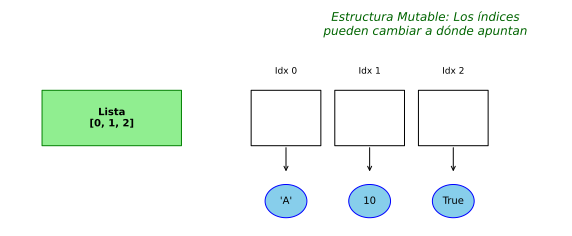

# 📚 Unidad 5. Estructuras de Datos

Python ofrece varias estructuras de datos incorporadas para almacenar colecciones de elementos. Las principales son: **listas**, **tuplas**, **diccionarios** y **conjuntos (sets)**.

---

## 5.1. Listas

Las **listas** son colecciones ordenadas y modificables de elementos.



### Creación de Listas

```python
# Lista vacía
lista_vacia = []
otra_lista_vacia = list()

# Lista con elementos
numeros = [1, 2, 3, 4, 5]
frutas = ["manzana", "naranja", "plátano"]
mixta = [1, "hola", 3.14, True, None]

# Lista con list()
letras = list("Python")  # ['P', 'y', 't', 'h', 'o', 'n']
rango = list(range(5))   # [0, 1, 2, 3, 4]
```

### Acceso a Elementos

```python
frutas = ["manzana", "naranja", "plátano", "uva", "pera"]

# Índices positivos (desde el inicio)
print(frutas[0])   # manzana (primero)
print(frutas[1])   # naranja
print(frutas[4])   # pera (último)

# Índices negativos (desde el final)
print(frutas[-1])  # pera (último)
print(frutas[-2])  # uva (penúltimo)

# Slicing (cortar)
print(frutas[1:4])    # ['naranja', 'plátano', 'uva']
print(frutas[:3])     # ['manzana', 'naranja', 'plátano']
print(frutas[2:])     # ['plátano', 'uva', 'pera']
print(frutas[::2])    # ['manzana', 'plátano', 'pera'] (cada 2)
print(frutas[::-1])   # Lista invertida
```

### Modificar Elementos

```python
numeros = [10, 20, 30, 40, 50]

# Cambiar un elemento
numeros[0] = 100
print(numeros)  # [100, 20, 30, 40, 50]

# Cambiar varios elementos con slicing
numeros[1:3] = [200, 300]
print(numeros)  # [100, 200, 300, 40, 50]
```

### Métodos de Listas

#### Añadir Elementos

```python
frutas = ["manzana", "naranja"]

# append() - Añadir al final
frutas.append("plátano")
print(frutas)  # ['manzana', 'naranja', 'plátano']

# insert() - Añadir en posición específica
frutas.insert(1, "uva")
print(frutas)  # ['manzana', 'uva', 'naranja', 'plátano']

# extend() - Añadir varios elementos
frutas.extend(["pera", "kiwi"])
print(frutas)  # ['manzana', 'uva', 'naranja', 'plátano', 'pera', 'kiwi']

# También con el operador +
frutas = frutas + ["mango"]
print(frutas)
```

#### Eliminar Elementos

```python
frutas = ["manzana", "naranja", "plátano", "naranja", "uva"]

# remove() - Eliminar por valor (primera ocurrencia)
frutas.remove("naranja")
print(frutas)  # ['manzana', 'plátano', 'naranja', 'uva']

# pop() - Eliminar por índice y devolver el valor
eliminado = frutas.pop(1)  # Elimina 'plátano'
print(eliminado)  # plátano
print(frutas)     # ['manzana', 'naranja', 'uva']

# pop() sin índice - Eliminar el último
ultimo = frutas.pop()
print(ultimo)  # uva
print(frutas)  # ['manzana', 'naranja']

# del - Eliminar por índice
del frutas[0]
print(frutas)  # ['naranja']

# clear() - Vaciar la lista
frutas.clear()
print(frutas)  # []
```

#### Búsqueda y Conteo

```python
numeros = [3, 1, 4, 1, 5, 9, 2, 6, 5, 3, 5]

# index() - Encontrar índice de un elemento
indice = numeros.index(9)
print(f"El 9 está en el índice {indice}")  # 5

# count() - Contar ocurrencias
cantidad = numeros.count(5)
print(f"El 5 aparece {cantidad} veces")  # 3

# in - Verificar si existe
print(7 in numeros)   # False
print(5 in numeros)   # True
```

#### Ordenación

```python
numeros = [3, 1, 4, 1, 5, 9, 2, 6]

# sort() - Ordenar la lista (modifica la original)
numeros.sort()
print(numeros)  # [1, 1, 2, 3, 4, 5, 6, 9]

# Orden descendente
numeros.sort(reverse=True)
print(numeros)  # [9, 6, 5, 4, 3, 2, 1, 1]

# sorted() - Devuelve una nueva lista ordenada (no modifica original)
original = [3, 1, 4, 1, 5]
ordenada = sorted(original)
print(original)  # [3, 1, 4, 1, 5]
print(ordenada)  # [1, 1, 3, 4, 5]

# Ordenar strings
palabras = ["banana", "Apple", "cherry"]
palabras.sort()  # Orden ASCII (mayúsculas primero)
print(palabras)  # ['Apple', 'banana', 'cherry']

palabras.sort(key=str.lower)  # Ignorar mayúsculas
print(palabras)  # ['Apple', 'banana', 'cherry']

# reverse() - Invertir la lista
numeros = [1, 2, 3, 4, 5]
numeros.reverse()
print(numeros)  # [5, 4, 3, 2, 1]
```

#### Otras Operaciones

```python
# copy() - Copiar lista
original = [1, 2, 3]
copia = original.copy()
# También: copia = list(original) o copia = original[:]

# Longitud
print(len(numeros))  # 5

# Suma, mínimo, máximo (para números)
numeros = [10, 5, 20, 15, 3]
print(sum(numeros))  # 53
print(min(numeros))  # 3
print(max(numeros))  # 20
```

### Listas Anidadas (Matrices)

```python
# Matriz 3x3
matriz = [
    [1, 2, 3],
    [4, 5, 6],
    [7, 8, 9]
]

# Acceder a elementos
print(matriz[0])      # [1, 2, 3] (primera fila)
print(matriz[1][2])   # 6 (fila 1, columna 2)

# Recorrer matriz
for fila in matriz:
    for elemento in fila:
        print(elemento, end=" ")
    print()

# Con índices
for i in range(len(matriz)):
    for j in range(len(matriz[i])):
        print(f"[{i}][{j}] = {matriz[i][j]}")
```

---

## 5.2. Tuplas

Las **tuplas** son colecciones ordenadas e **inmutables** (no se pueden modificar).

### Creación de Tuplas

```python
# Tupla vacía
tupla_vacia = ()
otra_vacia = tuple()

# Tupla con elementos
coordenadas = (10, 20)
datos = ("Ana", 25, "Madrid")
mixta = (1, "hola", 3.14)

# Tupla de un solo elemento (necesita coma)
un_elemento = (42,)  # Con coma
no_tupla = (42)      # Esto es solo un int

# Sin paréntesis (empaquetado)
punto = 5, 10
print(punto)  # (5, 10)
```

### Acceso a Elementos

```python
colores = ("rojo", "verde", "azul", "amarillo")

# Igual que las listas
print(colores[0])     # rojo
print(colores[-1])    # amarillo
print(colores[1:3])   # ('verde', 'azul')

# Desempaquetado
x, y, z = (1, 2, 3)
print(x, y, z)  # 1 2 3

# Desempaquetado con *
primero, *resto = (1, 2, 3, 4, 5)
print(primero)  # 1
print(resto)    # [2, 3, 4, 5]

*inicio, ultimo = (1, 2, 3, 4, 5)
print(inicio)  # [1, 2, 3, 4]
print(ultimo)  # 5
```

### Inmutabilidad

```python
tupla = (1, 2, 3)

# NO se puede modificar
# tupla[0] = 100  # Error: TypeError

# Pero se puede crear una nueva
nueva = tupla + (4, 5)
print(nueva)  # (1, 2, 3, 4, 5)
```

### Métodos de Tuplas

Las tuplas tienen menos métodos que las listas (por ser inmutables):

```python
numeros = (1, 2, 3, 2, 4, 2, 5)

# count() - Contar ocurrencias
print(numeros.count(2))  # 3

# index() - Encontrar índice
print(numeros.index(4))  # 4
```

### Cuándo Usar Tuplas

*   Datos que no deben cambiar (coordenadas, configuración).
*   Claves de diccionarios (las listas no pueden ser claves).
*   Retornar múltiples valores de una función.
*   Son más eficientes que las listas.

```python
# Retornar múltiples valores
def dividir(a, b):
    cociente = a // b
    resto = a % b
    return cociente, resto  # Devuelve tupla

resultado = dividir(17, 5)
print(resultado)  # (3, 2)

# Desempaquetando directamente
c, r = dividir(17, 5)
print(f"Cociente: {c}, Resto: {r}")
```

---

## 5.3. Diccionarios

Los **diccionarios** almacenan pares clave-valor. Utilizan tablas hash internamente para búsquedas muy rápidas.


### Creación de Diccionarios

```python
# Diccionario vacío
vacio = {}
otro_vacio = dict()

# Con elementos
persona = {
    "nombre": "Ana",
    "edad": 30,
    "ciudad": "Madrid"
}

# Con dict()
datos = dict(nombre="Luis", edad=25)
print(datos)  # {'nombre': 'Luis', 'edad': 25}

# Desde lista de tuplas
items = [("a", 1), ("b", 2), ("c", 3)]
diccionario = dict(items)
print(diccionario)  # {'a': 1, 'b': 2, 'c': 3}
```

### Acceso a Valores

```python
persona = {"nombre": "Ana", "edad": 30, "ciudad": "Madrid"}

# Con corchetes
print(persona["nombre"])  # Ana
# print(persona["email"])  # KeyError si no existe

# Con get() (más seguro)
print(persona.get("nombre"))    # Ana
print(persona.get("email"))     # None (no error)
print(persona.get("email", "No especificado"))  # Valor por defecto
```

### Modificar Diccionarios

```python
persona = {"nombre": "Ana", "edad": 30}

# Modificar valor existente
persona["edad"] = 31
print(persona)  # {'nombre': 'Ana', 'edad': 31}

# Añadir nuevo par clave-valor
persona["ciudad"] = "Madrid"
persona["email"] = "ana@email.com"
print(persona)

# update() - Añadir/actualizar múltiples
persona.update({"edad": 32, "telefono": "123456"})
print(persona)
```

### Eliminar Elementos

```python
persona = {
    "nombre": "Ana",
    "edad": 30,
    "ciudad": "Madrid",
    "email": "ana@email.com"
}

# del - Eliminar por clave
del persona["email"]
print(persona)

# pop() - Eliminar y devolver valor
ciudad = persona.pop("ciudad")
print(f"Ciudad eliminada: {ciudad}")
print(persona)

# pop() con valor por defecto
telefono = persona.pop("telefono", "No existía")
print(telefono)  # No existía

# popitem() - Eliminar último elemento
persona["pais"] = "España"
item = persona.popitem()
print(f"Eliminado: {item}")  # ('pais', 'España')

# clear() - Vaciar diccionario
persona.clear()
print(persona)  # {}
```

### Métodos de Diccionarios

```python
persona = {"nombre": "Ana", "edad": 30, "ciudad": "Madrid"}

# keys() - Obtener claves
print(persona.keys())    # dict_keys(['nombre', 'edad', 'ciudad'])
print(list(persona.keys()))  # ['nombre', 'edad', 'ciudad']

# values() - Obtener valores
print(persona.values())  # dict_values(['Ana', 30, 'Madrid'])
print(list(persona.values()))  # ['Ana', 30, 'Madrid']

# items() - Obtener pares clave-valor
print(persona.items())  # dict_items([('nombre', 'Ana'), ...])

# Verificar si existe una clave
print("nombre" in persona)  # True
print("email" in persona)   # False
```

### Iterar sobre Diccionarios

```python
persona = {"nombre": "Ana", "edad": 30, "ciudad": "Madrid"}

# Iterar claves (por defecto)
for clave in persona:
    print(clave)

# Iterar valores
for valor in persona.values():
    print(valor)

# Iterar claves y valores
for clave, valor in persona.items():
    print(f"{clave}: {valor}")
```

### Diccionarios Anidados

```python
estudiantes = {
    "ana": {
        "edad": 20,
        "notas": [8, 9, 7],
        "ciudad": "Madrid"
    },
    "luis": {
        "edad": 22,
        "notas": [6, 7, 8],
        "ciudad": "Barcelona"
    }
}

# Acceder a datos anidados
print(estudiantes["ana"]["edad"])        # 20
print(estudiantes["ana"]["notas"][0])    # 8

# Recorrer
for nombre, datos in estudiantes.items():
    promedio = sum(datos["notas"]) / len(datos["notas"])
    print(f"{nombre}: promedio = {promedio:.1f}")
```

### Comprensión de Diccionarios

```python
# Crear diccionario con comprensión
cuadrados = {x: x**2 for x in range(6)}
print(cuadrados)  # {0: 0, 1: 1, 2: 4, 3: 9, 4: 16, 5: 25}

# Con condición
pares = {x: x**2 for x in range(10) if x % 2 == 0}
print(pares)  # {0: 0, 2: 4, 4: 16, 6: 36, 8: 64}

# Invertir claves y valores
original = {"a": 1, "b": 2, "c": 3}
invertido = {v: k for k, v in original.items()}
print(invertido)  # {1: 'a', 2: 'b', 3: 'c'}
```

---

## 5.4. Conjuntos (Sets)

Los **sets** son colecciones desordenadas de elementos únicos.

### Creación de Sets

```python
# Set vacío (no se puede usar {}, eso crea un diccionario)
vacio = set()

# Con elementos
numeros = {1, 2, 3, 4, 5}
letras = {"a", "b", "c"}

# Los duplicados se eliminan automáticamente
con_duplicados = {1, 2, 2, 3, 3, 3}
print(con_duplicados)  # {1, 2, 3}

# Desde lista (elimina duplicados)
lista = [1, 2, 2, 3, 3, 4]
conjunto = set(lista)
print(conjunto)  # {1, 2, 3, 4}
```

### Operaciones Básicas

```python
frutas = {"manzana", "naranja", "plátano"}

# Añadir elemento
frutas.add("uva")
print(frutas)

# Añadir varios elementos
frutas.update(["pera", "kiwi"])
print(frutas)

# Eliminar elemento
frutas.remove("naranja")  # Error si no existe
frutas.discard("mango")   # No error si no existe

# pop() - Eliminar elemento aleatorio
elemento = frutas.pop()
print(f"Eliminado: {elemento}")

# Verificar pertenencia
print("manzana" in frutas)  # True o False
```

### Operaciones de Conjuntos


```python
A = {1, 2, 3, 4, 5}
B = {4, 5, 6, 7, 8}

# Unión (elementos en A o B)
union = A | B  # o A.union(B)
print(union)   # {1, 2, 3, 4, 5, 6, 7, 8}

# Intersección (elementos en A y B)
interseccion = A & B  # o A.intersection(B)
print(interseccion)   # {4, 5}

# Diferencia (elementos en A pero no en B)
diferencia = A - B  # o A.difference(B)
print(diferencia)   # {1, 2, 3}

# Diferencia simétrica (elementos en A o B pero no en ambos)
sim_diferencia = A ^ B  # o A.symmetric_difference(B)
print(sim_diferencia)   # {1, 2, 3, 6, 7, 8}
```

### Verificar Subconjuntos

```python
A = {1, 2, 3}
B = {1, 2, 3, 4, 5}
C = {1, 2, 3}

# Subconjunto
print(A <= B)  # True (A es subconjunto de B)
print(A.issubset(B))  # True

# Subconjunto propio (más pequeño)
print(A < B)   # True
print(A < C)   # False (son iguales)

# Superconjunto
print(B >= A)  # True
print(B.issuperset(A))  # True

# Conjuntos disjuntos (sin elementos comunes)
X = {1, 2, 3}
Y = {4, 5, 6}
print(X.isdisjoint(Y))  # True
```

### Ejemplo: Eliminar Duplicados

```python
# Eliminar duplicados de una lista
lista_con_duplicados = [1, 2, 2, 3, 4, 4, 4, 5]
lista_sin_duplicados = list(set(lista_con_duplicados))
print(lista_sin_duplicados)  # [1, 2, 3, 4, 5]

# Nota: el orden puede no conservarse
# Para conservar orden (Python 3.7+):
from collections import OrderedDict
lista_ordenada = list(dict.fromkeys(lista_con_duplicados))
print(lista_ordenada)  # [1, 2, 2, 3, 4, 5] (mantiene orden)
```

---

## 5.5. Comparación de Estructuras de Datos

| Característica | Lista | Tupla | Diccionario | Set |
| :--- | :--- | :--- | :--- | :--- |
| Sintaxis | `[1, 2]` | `(1, 2)` | `{"a": 1}` | `{1, 2}` |
| Ordenada | ✓ | ✓ | ✓ (3.7+) | ✗ |
| Modificable | ✓ | ✗ | ✓ | ✓ |
| Duplicados | ✓ | ✓ | Claves únicas | ✗ |
| Indexable | ✓ | ✓ | Por clave | ✗ |
| Uso típico | Colección general | Datos fijos | Mapeo clave-valor | Elementos únicos |

---

## 5.6. Ejercicios Prácticos

### Ejercicio 1: Gestión de Lista de Tareas

```python
tareas = []

while True:
    print("\n=== GESTOR DE TAREAS ===")
    print("1. Ver tareas")
    print("2. Añadir tarea")
    print("3. Completar tarea")
    print("4. Eliminar tarea")
    print("5. Salir")
    
    opcion = input("Opción: ")
    
    if opcion == "1":
        if not tareas:
            print("No hay tareas")
        else:
            for i, tarea in enumerate(tareas, 1):
                print(f"{i}. {tarea}")
    
    elif opcion == "2":
        nueva = input("Nueva tarea: ")
        tareas.append(nueva)
        print("Tarea añadida")
    
    elif opcion == "3":
        indice = int(input("Número de tarea completada: ")) - 1
        if 0 <= indice < len(tareas):
            completada = tareas.pop(indice)
            print(f"¡Completada: {completada}!")
        else:
            print("Índice no válido")
    
    elif opcion == "4":
        indice = int(input("Número de tarea a eliminar: ")) - 1
        if 0 <= indice < len(tareas):
            eliminada = tareas.pop(indice)
            print(f"Eliminada: {eliminada}")
        else:
            print("Índice no válido")
    
    elif opcion == "5":
        print("¡Hasta luego!")
        break
```

### Ejercicio 2: Agenda de Contactos

```python
contactos = {}

while True:
    print("\n=== AGENDA DE CONTACTOS ===")
    print("1. Ver contactos")
    print("2. Añadir contacto")
    print("3. Buscar contacto")
    print("4. Eliminar contacto")
    print("5. Salir")
    
    opcion = input("Opción: ")
    
    if opcion == "1":
        if not contactos:
            print("No hay contactos")
        else:
            for nombre, telefono in contactos.items():
                print(f"  {nombre}: {telefono}")
    
    elif opcion == "2":
        nombre = input("Nombre: ")
        telefono = input("Teléfono: ")
        contactos[nombre] = telefono
        print(f"Contacto '{nombre}' añadido")
    
    elif opcion == "3":
        nombre = input("Nombre a buscar: ")
        telefono = contactos.get(nombre)
        if telefono:
            print(f"{nombre}: {telefono}")
        else:
            print("Contacto no encontrado")
    
    elif opcion == "4":
        nombre = input("Nombre a eliminar: ")
        if nombre in contactos:
            del contactos[nombre]
            print(f"Contacto '{nombre}' eliminado")
        else:
            print("Contacto no encontrado")
    
    elif opcion == "5":
        break
```

### Ejercicio 3: Análisis de Texto

```python
texto = input("Introduce un texto: ")

# Contar caracteres (sin espacios)
caracteres = len(texto.replace(" ", ""))

# Contar palabras
palabras = texto.split()
num_palabras = len(palabras)

# Palabra más larga
palabra_larga = max(palabras, key=len) if palabras else ""

# Caracteres únicos
caracteres_unicos = set(texto.lower().replace(" ", ""))

# Frecuencia de palabras
frecuencia = {}
for palabra in palabras:
    palabra = palabra.lower()
    frecuencia[palabra] = frecuencia.get(palabra, 0) + 1

print(f"\nCaracteres: {caracteres}")
print(f"Palabras: {num_palabras}")
print(f"Palabra más larga: '{palabra_larga}'")
print(f"Caracteres únicos: {len(caracteres_unicos)}")
print(f"\nFrecuencia de palabras:")
for palabra, cuenta in sorted(frecuencia.items(), key=lambda x: x[1], reverse=True):
    print(f"  {palabra}: {cuenta}")
```

### Ejercicio 4: Operaciones con Conjuntos

```python
print("=== COMPARADOR DE LISTAS ===")

# Pedir dos listas de números
entrada1 = input("Lista 1 (números separados por comas): ")
entrada2 = input("Lista 2 (números separados por comas): ")

# Convertir a sets
set1 = set(map(int, entrada1.split(",")))
set2 = set(map(int, entrada2.split(",")))

print(f"\nConjunto 1: {set1}")
print(f"Conjunto 2: {set2}")

print(f"\nElementos en ambos: {set1 & set2}")
print(f"Elementos en al menos uno: {set1 | set2}")
print(f"Solo en conjunto 1: {set1 - set2}")
print(f"Solo en conjunto 2: {set2 - set1}")
print(f"En uno pero no en ambos: {set1 ^ set2}")
```

---

## 5.7. Resumen

| Estructura | Creación | Características |
| :--- | :--- | :--- |
| **Lista** | `[]` | Ordenada, mutable, permite duplicados |
| **Tupla** | `()` | Ordenada, inmutable, permite duplicados |
| **Dict** | `{}` | Pares clave-valor, claves únicas |
| **Set** | `set()` | No ordenado, mutable, sin duplicados |

---

📅 **Fecha de creación:** Enero 2026  
✍️ **Autor:** Fran García
