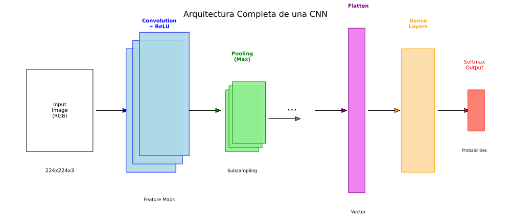

# 🧠 Unidad 2. Redes Neuronales Convolucionales (CNN)

Las **Redes Neuronales Convolucionales** (Convolutional Neural Networks - CNN) son arquitecturas especializadas en procesar datos con estructura de cuadrícula, como imágenes. Son el estándar para tareas de visión por computadora.



---

## 2.1. ¿Por qué CNN para Imágenes?

### Limitaciones de las Redes Fully Connected

Una imagen de 224x224 píxeles con 3 canales (RGB) tiene:
$$224 \times 224 \times 3 = 150,528 \text{ valores de entrada}$$

Si conectamos esto a una capa oculta de 1000 neuronas:
$$150,528 \times 1000 = 150,528,000 \text{ parámetros}$$

**Problemas:**

*   Demasiados parámetros (overfitting, memoria).
*   No aprovecha la estructura espacial de la imagen.
*   No es invariante a traslaciones.

### Ventajas de las CNN

*   **Conexiones locales:** Cada neurona ve solo una región pequeña.
*   **Compartición de pesos:** Los mismos filtros se aplican en toda la imagen.
*   **Invariancia a traslaciones:** Detectan patrones sin importar su posición.
*   **Jerarquía de características:** Capas iniciales detectan bordes, las profundas detectan objetos.

---

## 2.2. La Operación de Convolución

La convolución es una operación matemática que aplica un **filtro** (kernel) sobre la imagen.

### Proceso

1.  El filtro se desliza sobre la imagen.
2.  En cada posición, se calcula el producto punto entre el filtro y la región de la imagen.
3.  El resultado forma un **mapa de características** (feature map).

### Visualización

```
Imagen (5x5):                Filtro (3x3):
┌─────────────────┐          ┌─────────┐
│ 1  2  3  4  5   │          │ 1  0 -1 │
│ 6  7  8  9  10  │    *     │ 1  0 -1 │  =  Feature Map
│ 11 12 13 14 15  │          │ 1  0 -1 │
│ 16 17 18 19 20  │          └─────────┘
│ 21 22 23 24 25  │
└─────────────────┘
```

### Implementación

```python
import numpy as np

def convolucion_2d(imagen, filtro, stride=1, padding=0):
    """
    Realiza convolución 2D.
    """
    # Padding
    if padding > 0:
        imagen = np.pad(imagen, padding, mode='constant')
    
    h_img, w_img = imagen.shape
    h_filtro, w_filtro = filtro.shape
    
    # Tamaño de salida
    h_out = (h_img - h_filtro) // stride + 1
    w_out = (w_img - w_filtro) // stride + 1
    
    output = np.zeros((h_out, w_out))
    
    for i in range(h_out):
        for j in range(w_out):
            region = imagen[i*stride:i*stride+h_filtro, j*stride:j*stride+w_filtro]
            output[i, j] = np.sum(region * filtro)
    
    return output

# Ejemplo: Detector de bordes verticales
imagen = np.array([
    [10, 10, 10, 0, 0, 0],
    [10, 10, 10, 0, 0, 0],
    [10, 10, 10, 0, 0, 0],
    [10, 10, 10, 0, 0, 0],
    [10, 10, 10, 0, 0, 0],
    [10, 10, 10, 0, 0, 0]
])

filtro_vertical = np.array([
    [1, 0, -1],
    [1, 0, -1],
    [1, 0, -1]
])

resultado = convolucion_2d(imagen, filtro_vertical)
print("Feature Map:\n", resultado)
```

---

## 2.3. Componentes de una CNN

### Capa Convolucional (Conv2D)

Aplica múltiples filtros para extraer diferentes características.

```python
from tensorflow.keras.layers import Conv2D

# 32 filtros de 3x3
conv_layer = Conv2D(
    filters=32,           # Número de filtros
    kernel_size=(3, 3),   # Tamaño del filtro
    strides=(1, 1),       # Paso del deslizamiento
    padding='same',       # 'same' mantiene dimensiones, 'valid' no usa padding
    activation='relu'
)
```

### Parámetros Importantes

| Parámetro | Descripción |
| :--- | :--- |
| `filters` | Número de filtros (profundidad del output) |
| `kernel_size` | Tamaño del filtro (típicamente 3x3 o 5x5) |
| `strides` | Paso del deslizamiento |
| `padding` | 'same' (mantiene tamaño) o 'valid' (reduce) |

### Capa de Pooling (MaxPool, AvgPool)

Reduce las dimensiones espaciales, manteniendo las características más importantes.


```python
from tensorflow.keras.layers import MaxPooling2D, AveragePooling2D

# Max Pooling: toma el valor máximo de cada región
max_pool = MaxPooling2D(pool_size=(2, 2))

# Average Pooling: toma el promedio
avg_pool = AveragePooling2D(pool_size=(2, 2))
```

**Max Pooling 2x2:**

```
┌─────────┐        ┌─────┐
│ 1  3 │ 2  4 │    │ 3 │ 4 │
│ 5  6 │ 7  8 │ →  │ 6 │ 8 │
├─────┼─────┤      └─────┘
│ 9  2 │ 3  1 │
│ 3  4 │ 2  5 │
└─────────┘
```

### Flatten y Capas Densas

Después de las convoluciones, se "aplana" el tensor para conectar con capas densas.

```python
from tensorflow.keras.layers import Flatten, Dense

# Flatten: convierte tensor 3D a 1D
flatten = Flatten()

# Dense: capas completamente conectadas
dense = Dense(128, activation='relu')
```

---

## 2.4. Arquitectura Típica de CNN

```
Input → [Conv → ReLU → Pool] × N → Flatten → Dense → Output

Ejemplo para clasificación de imágenes:
- Input: 224x224x3
- Conv2D(32, 3x3) → ReLU → MaxPool(2x2)  →  112x112x32
- Conv2D(64, 3x3) → ReLU → MaxPool(2x2)  →  56x56x64
- Conv2D(128, 3x3) → ReLU → MaxPool(2x2) →  28x28x128
- Flatten                                 →  100,352
- Dense(256) → ReLU                       →  256
- Dense(10) → Softmax                     →  10 clases
```

### Implementación en Keras

```python
from tensorflow.keras import Sequential
from tensorflow.keras.layers import Conv2D, MaxPooling2D, Flatten, Dense, Dropout, Input

def crear_cnn(input_shape, num_clases):
    """
    Crea una CNN básica para clasificación de imágenes.
    """
    modelo = Sequential([
        Input(shape=input_shape),
        
        # Bloque 1
        Conv2D(32, (3, 3), activation='relu', padding='same'),
        Conv2D(32, (3, 3), activation='relu', padding='same'),
        MaxPooling2D((2, 2)),
        
        # Bloque 2
        Conv2D(64, (3, 3), activation='relu', padding='same'),
        Conv2D(64, (3, 3), activation='relu', padding='same'),
        MaxPooling2D((2, 2)),
        
        # Bloque 3
        Conv2D(128, (3, 3), activation='relu', padding='same'),
        Conv2D(128, (3, 3), activation='relu', padding='same'),
        MaxPooling2D((2, 2)),
        
        # Clasificador
        Flatten(),
        Dense(256, activation='relu'),
        Dropout(0.5),
        Dense(num_clases, activation='softmax')
    ])
    
    return modelo

# Crear modelo para CIFAR-10 (imágenes 32x32x3, 10 clases)
modelo = crear_cnn((32, 32, 3), 10)
modelo.summary()
```

---

## 2.5. Ejemplo Completo: Clasificación CIFAR-10

```python
import tensorflow as tf
from tensorflow.keras.datasets import cifar10
from tensorflow.keras.utils import to_categorical
import matplotlib.pyplot as plt

# Cargar datos
(X_train, y_train), (X_test, y_test) = cifar10.load_data()

# Nombres de las clases
clases = ['avión', 'auto', 'pájaro', 'gato', 'venado', 
          'perro', 'rana', 'caballo', 'barco', 'camión']

# Preprocesamiento
X_train = X_train.astype('float32') / 255.0
X_test = X_test.astype('float32') / 255.0
y_train = to_categorical(y_train, 10)
y_test = to_categorical(y_test, 10)

print(f"Train: {X_train.shape}, Test: {X_test.shape}")

# Crear modelo
modelo = crear_cnn((32, 32, 3), 10)

# Compilar
modelo.compile(
    optimizer='adam',
    loss='categorical_crossentropy',
    metrics=['accuracy']
)

# Entrenar
historia = modelo.fit(
    X_train, y_train,
    epochs=20,
    batch_size=64,
    validation_split=0.1,
    verbose=1
)

# Evaluar
loss, accuracy = modelo.evaluate(X_test, y_test)
print(f"\nAccuracy en test: {accuracy:.4f}")

# Visualizar algunas predicciones
predicciones = modelo.predict(X_test[:10])

fig, axes = plt.subplots(2, 5, figsize=(15, 6))
for i, ax in enumerate(axes.flat):
    ax.imshow(X_test[i])
    pred_clase = clases[predicciones[i].argmax()]
    real_clase = clases[y_test[i].argmax()]
    color = 'green' if pred_clase == real_clase else 'red'
    ax.set_title(f'Pred: {pred_clase}\nReal: {real_clase}', color=color)
    ax.axis('off')
plt.tight_layout()
plt.show()
```

---

## 2.6. Arquitecturas Famosas

### LeNet-5 (1998)

La primera CNN exitosa, diseñada para reconocimiento de dígitos.

```python
def lenet5(input_shape=(28, 28, 1), num_clases=10):
    return Sequential([
        Input(shape=input_shape),
        Conv2D(6, (5, 5), activation='tanh'),
        MaxPooling2D((2, 2)),
        Conv2D(16, (5, 5), activation='tanh'),
        MaxPooling2D((2, 2)),
        Flatten(),
        Dense(120, activation='tanh'),
        Dense(84, activation='tanh'),
        Dense(num_clases, activation='softmax')
    ])
```

### VGG (2014)

Arquitectura profunda con filtros pequeños (3x3).

```python
def vgg_block(num_convs, num_filters):
    """Un bloque VGG: múltiples Conv2D seguidas de MaxPool."""
    layers = []
    for _ in range(num_convs):
        layers.append(Conv2D(num_filters, (3, 3), activation='relu', padding='same'))
    layers.append(MaxPooling2D((2, 2)))
    return layers
```

### ResNet (2015)

Introdujo las **conexiones residuales** (skip connections) para entrenar redes muy profundas.

```python
from tensorflow.keras.layers import Add

def bloque_residual(x, filtros):
    """Bloque residual de ResNet."""
    # Rama principal
    fx = Conv2D(filtros, (3, 3), padding='same', activation='relu')(x)
    fx = Conv2D(filtros, (3, 3), padding='same')(fx)
    
    # Skip connection
    out = Add()([x, fx])
    out = tf.keras.activations.relu(out)
    
    return out
```

### Comparación

| Arquitectura | Año | Capas | Parámetros | Top-5 Error (ImageNet) |
| :--- | :--- | :--- | :--- | :--- |
| LeNet-5 | 1998 | 5 | 60K | - |
| AlexNet | 2012 | 8 | 60M | 16.4% |
| VGG-16 | 2014 | 16 | 138M | 7.3% |
| ResNet-50 | 2015 | 50 | 25M | 3.6% |
| EfficientNet-B7 | 2019 | 66M | 66M | 2.9% |

---

## 2.7. Data Augmentation

Técnica para aumentar artificialmente el dataset aplicando transformaciones a las imágenes.

```python
from tensorflow.keras.preprocessing.image import ImageDataGenerator

# Generador con aumentaciones
datagen = ImageDataGenerator(
    rotation_range=15,          # Rotación aleatoria
    width_shift_range=0.1,      # Desplazamiento horizontal
    height_shift_range=0.1,     # Desplazamiento vertical
    horizontal_flip=True,       # Volteo horizontal
    zoom_range=0.1,             # Zoom aleatorio
    shear_range=0.1,            # Cizallamiento
    fill_mode='nearest'         # Cómo rellenar píxeles vacíos
)

# Usar en entrenamiento
modelo.fit(
    datagen.flow(X_train, y_train, batch_size=32),
    epochs=50,
    validation_data=(X_test, y_test)
)
```

### Data Augmentation con tf.keras.layers

```python
from tensorflow.keras.layers import RandomFlip, RandomRotation, RandomZoom

# Capa de aumentación como parte del modelo
data_augmentation = Sequential([
    RandomFlip("horizontal"),
    RandomRotation(0.1),
    RandomZoom(0.1),
])

# Aplicar solo durante entrenamiento
modelo = Sequential([
    Input(shape=(224, 224, 3)),
    data_augmentation,
    # ... resto del modelo
])
```

---

## 2.8. Transfer Learning

Usar modelos preentrenados en grandes datasets (ImageNet) y adaptarlos a nuestro problema.

### Estrategias

1.  **Feature Extraction:** Congelar las capas convolucionales, entrenar solo el clasificador.
2.  **Fine-tuning:** Descongelar algunas capas superiores y entrenarlas con learning rate bajo.

```python
from tensorflow.keras.applications import VGG16
from tensorflow.keras.layers import GlobalAveragePooling2D

# Cargar modelo preentrenado (sin la cabeza de clasificación)
base_model = VGG16(
    weights='imagenet',
    include_top=False,
    input_shape=(224, 224, 3)
)

# Congelar capas del modelo base
base_model.trainable = False

# Añadir nuevo clasificador
modelo = Sequential([
    base_model,
    GlobalAveragePooling2D(),
    Dense(256, activation='relu'),
    Dropout(0.5),
    Dense(10, activation='softmax')  # 10 nuevas clases
])

# Entrenar solo las capas nuevas
modelo.compile(optimizer='adam', loss='categorical_crossentropy', metrics=['accuracy'])
modelo.fit(X_train, y_train, epochs=10)

# Fine-tuning: descongelar últimas capas
base_model.trainable = True
for layer in base_model.layers[:-4]:  # Congelar todas menos las últimas 4
    layer.trainable = False

# Recompilar con learning rate bajo
modelo.compile(
    optimizer=tf.keras.optimizers.Adam(1e-5),  # LR muy bajo
    loss='categorical_crossentropy',
    metrics=['accuracy']
)
modelo.fit(X_train, y_train, epochs=10)
```

---

## 2.9. Aplicaciones de CNN

### Clasificación de Imágenes

Asignar una etiqueta a toda la imagen.

### Detección de Objetos

Localizar y clasificar múltiples objetos en una imagen.

*   **YOLO (You Only Look Once)**
*   **Faster R-CNN**
*   **SSD (Single Shot Detector)**

### Segmentación Semántica

Clasificar cada píxel de la imagen.

*   **U-Net** (para imágenes médicas)
*   **Mask R-CNN** (segmentación de instancias)

### Reconocimiento Facial

*   Detección de caras
*   Verificación de identidad
*   Análisis de expresiones

---

## 2.10. Visualización de Filtros y Feature Maps

```python
import numpy as np
import matplotlib.pyplot as plt

# Visualizar filtros de la primera capa convolucional
filtros = modelo.layers[0].get_weights()[0]

fig, axes = plt.subplots(4, 8, figsize=(16, 8))
for i, ax in enumerate(axes.flat):
    if i < filtros.shape[-1]:
        # Normalizar filtro para visualización
        f = filtros[:, :, :, i]
        f = (f - f.min()) / (f.max() - f.min())
        ax.imshow(f)
    ax.axis('off')
plt.suptitle('Filtros de la Primera Capa Convolucional')
plt.tight_layout()
plt.show()

# Visualizar feature maps
from tensorflow.keras.models import Model

# Crear modelo que devuelve feature maps intermedios
capa_intermedia = Model(
    inputs=modelo.input,
    outputs=modelo.layers[2].output  # Después de primera convolución
)

# Obtener feature maps para una imagen
img = X_test[0:1]  # Una imagen
feature_maps = capa_intermedia.predict(img)

# Visualizar
fig, axes = plt.subplots(4, 8, figsize=(16, 8))
for i, ax in enumerate(axes.flat):
    if i < feature_maps.shape[-1]:
        ax.imshow(feature_maps[0, :, :, i], cmap='viridis')
    ax.axis('off')
plt.suptitle('Feature Maps de la Primera Capa')
plt.tight_layout()
plt.show()
```

---

📅 **Fecha de creación:** Enero 2026  
✍️ **Autor:** Fran García
